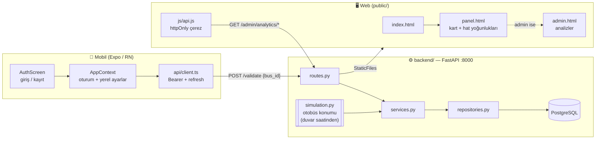

# Arnavutköy Belediyesi — Akbil Simülasyon Projesi

Üç parçadan oluşur ve **tek doğruluk kaynağı backend'dir**: hat, durak, otobüs
konumu, yolculuk ve favori verisi yalnızca sunucuda yaşar; istemciler bunları
hesaplamaz, yalnızca gösterir.

| Klasör | Ne yapar |
|---|---|
| `backend/` | FastAPI + PostgreSQL. Kimlik doğrulama, otobüs simülasyonu, yolculuk kayıtları ve yönetim analitiği. Web sitesini de bu süreç servis eder. |
| `public/` | Web sitesi (saf HTML/CSS/JS). Giriş/kayıt, yolcu paneli ve yönetici analiz paneli. Derleme adımı yoktur. |
| `mobile/` | Akbil basmayı simüle eden mobil uygulama (Expo / React Native, TypeScript). Giriş zorunludur. |

## Sistem mimarisi



### Bir yolculuğun hayatı

1. **Biniş:** Mobilde "Bin" → `POST /api/v1/validate {bus_id}`. Durak
   **gönderilmez**: sunucu, aracın o anki konumundan belirler. Araç durakta
   değilse istek 409 ile reddedilir — kural sunucuda zorlanır, istemci taklit
   edemez.
2. Sunucu `Trip` kaydını `OPEN` açar ve aracın son durağa varacağı anı
   `auto_alight_at` olarak damgalar.
3. **İniş:** Aynı uca ikinci kez basılır. Sunucu açık yolculuğu görür,
   `COMPLETED` yapar. Kayıt **iniş anında** yazılır; telefon geçmiş göndermez.
4. **İnilmezse:** `auto_alight_at` geçince arkaplan görevi
   (`TripService.close_due`) yolculuğu son durakta kapatır. Uygulama kapalıyken
   de doğru işler, çünkü an binişte hesaplanıp saklanmıştır.
5. **Geçmiş:** `GET /api/v1/trips` yalnızca giriş yapan kullanıcının kayıtlarını
   döndürür.

### Otobüs simülasyonu

Araç konumu **duvar saatinden deterministik** hesaplanır (`app/simulation.py`);
hiçbir durum saklanmaz, sunucu yeniden başlasa da aynı anda aynı sonucu verir.
Tarife `LineStop.minutes_from_previous` alanından gelir.

- Hat başına **3 araç**, sefer döngüsüne eşit aralıklarla dağıtılır.
- Araç her durakta **3 sim-dakika** bekler (`SIM_SPEED=10` ile gerçek ~18 sn).
  Biniş ve iniş yalnızca bu pencerede yapılabilir.
- Son durakta **6 sim-dakika** mola verilir; bu sırada yolcu alınmaz.
- `SIM_SPEED` çarpanı `.env` içindedir (10 → gerçek 30 sn ≈ 5 sim-dakika).

### API sözleşmesi (`/api/v1`)

| Uç nokta | Metod | Görev |
|---|---|---|
| `/auth/register`, `/auth/login`, `/auth/refresh`, `/auth/logout` | POST | Kimlik. Login ayrıca httpOnly çerez basar (web için). |
| `/passengers/me` | GET/PATCH | Oturum sahibinin bilgileri |
| `/cards` | GET | Kullanıcının kartları |
| `/transit/lines` | GET | Hatlar + `hourly_profile` + `peak_hours` |
| `/transit/lines/{id}` | GET | Hat + sıralı duraklar |
| `/transit/lines/{id}/buses` | GET | **Canlı araç konumları** |
| `/favorites` | GET/POST/DELETE | Favori hatlar |
| `/trips`, `/trips/active` | GET | Kullanıcının kendi yolculukları |
| `/validate` | POST | Kart bas — biniş ya da iniş |
| `/admin/analytics/*` | GET | overview · lines · stops · pairs · card-types |
| `/admin/trips` | GET | Son yolculuklar |
| `/health` | GET | Bağlantı testi |

Kimlik iki yolla taşınır: **mobil** `Authorization: Bearer`, **web** httpOnly
`akbil_access` çerezi. Doğrulama tektir (`deps.get_current_passenger`).

### Yönetici koruması

`/admin` sayfası iki katmanla korunur:

1. **Sayfa:** `GET /admin` FastAPI route'u çerezi doğrular. Yönetici değilse
   HTML hiç üretilmez, `/` adresine yönlendirilir — adres çubuğuna elle yazmak
   işe yaramaz.
2. **Veri:** `/api/v1/admin/*` uçları `get_current_admin` ile 403 döner.

Üst banttaki "Yönetim" bağlantısı yalnızca `is_admin` doğruysa basılır; bu
sadece görsel kolaylıktır, güvenlik yukarıdaki iki katmandadır.

### Yoğunluk renk kodu

Yönetim panelindeki yeşil/sarı/kırmızı kararı **sunucuda** verilir
(`load_level`), web yalnızca boyar. Renk tek başına anlam taşımasın diye her
yerde metin etiketiyle birlikte gösterilir.

- **Hat:** zirve saatteki biniş ÷ aktif otobüs, `BUS_CAPACITY`'ye oranla →
  `<%40` yeşil *"sefer azaltılabilir"* · `%40–75` normal · `>%75` kırmızı
  *"sefer artırılmalı"*.
- **Durak:** kullanım ÷ en yoğun durağın kullanımı → `<%35` yeşil · `%35–70`
  sarı · `>%70` kırmızı.

İki yoğunluk kavramı bilinçle ayrıdır: yolcuya gösterilen `Line.hourly_profile`
hattın **beklenen** profilidir (`lines.json`), yönetim analitiği ise **gerçek**
`Trip` kayıtlarından hesaplanır.

## 1. Backend'i başlat

```powershell
cd backend
docker compose up -d          # PostgreSQL 16

python -m venv .venv
.\.venv\Scripts\Activate.ps1
pip install -r requirements.txt

copy .env.example .env        # SECRET_KEY ve CARD_TOKEN_SECRET değerlerini değiştirin
alembic upgrade head
python -m app.seed            # hat, durak ve otobüsleri yükler

uvicorn app.main:app --reload --host 0.0.0.0 --port 8000
```

- Web sitesi: <http://localhost:8000>
- API dokümanı: <http://localhost:8000/docs>
- `--host 0.0.0.0` telefonun bilgisayara ulaşabilmesi için gereklidir.

Yönetici hesabı (kayıt ucu asla yönetici üretmez, tek yol budur):

```powershell
python -m app.seed --admin admin@arnavutkoy.bel.tr Admin12345
```

## 2. Mobil uygulamayı başlat

```powershell
cd mobile
npm install        # ilk seferde
npm start
```

- **Telefonda (önerilen):** QR kodu **Expo Go** ile okutun. Telefon ve
  bilgisayar aynı Wi-Fi'da olmalı.
- **Bilgisayarda:** `npm run web`.

Backend adresi **elle girilmez**: uygulama, kendisini indirdiği Expo/Metro
sunucusunun adresinden türetir (aynı bilgisayar, port 8000). Böylece Wi-Fi ya da
DHCP adresi değiştiğinde hiçbir dosya güncellenmez. Adres açılışta Metro
günlüğüne yazılır: `[akbil] backend adresi: http://…:8000`.

Yalnızca backend **başka bir makinede** ya da başka bir portta çalışıyorsa
`mobile/.env` içindeki `EXPO_PUBLIC_BACKEND_URL` doldurulur. `.env` değişince
Metro önbelleğini temizleyin: `npx expo start -c`.

### Telefon backend'e ulaşamıyorsa

Belirti hangi katmanın koptuğunu söyler:

| Belirti | Sebep | Çözüm |
|---|---|---|
| Uygulama **hiç açılmıyor** (QR'da IOException) | Telefon bilgisayara hiç ulaşamıyor: Wi-Fi istemci yalıtımı (AP isolation) ya da farklı ağ | Aynı Wi-Fi'da olun; kurumsal/misafir ağda yalıtım açıksa telefonun hotspot'unu kullanın |
| Uygulama açılıyor, **"Sunucuya ulaşılamadı"** | Backend çalışmıyor **veya** 8000 portu güvenlik duvarında kapalı | Aşağıdaki iki adım |

**1. Backend gerçekten dinliyor mu?**

```powershell
Get-NetTCPConnection -State Listen | Where-Object LocalPort -eq 8000
```

Boş dönerse uvicorn çalışmıyordur. `--host 0.0.0.0` ile başlatın; `127.0.0.1`
ile başlatılırsa yalnızca bilgisayarın kendisi erişebilir.

**2. Güvenlik duvarı 8000'e izin veriyor mu?**

Windows kuralları **dosya yoluna** göredir: sistem python'una verilmiş bir izin
`backend\.venv\Scripts\python.exe` için geçerli değildir. Port bazlı kural bu
yüzden gerekir (yönetici PowerShell):

```powershell
New-NetFirewallRule -DisplayName "AkBil backend 8000" `
  -Direction Inbound -Protocol TCP -LocalPort 8000 `
  -Action Allow -Profile Private,Public
```

Geri almak için: `Remove-NetFirewallRule -DisplayName "AkBil backend 8000"`

Doğrulama: telefonun tarayıcısında `http://<bilgisayar-ip>:8000/health` adresini
açın. `{"status":"ok"}` görünüyorsa ağ yolu tamamdır.

## Uygulama kuralları

- **Giriş zorunludur.** Kullanıcı listesi, demo kipi ve geliştirici ayarları
  kaldırıldı — uygulamaya yalnızca hesapla girilir.
- **Yalnızca duraktaki araca binilir/inilir.** Durak seçilmez; kayda aracın o an
  beklediği durak yazılır. Kuralı sunucu uygular.
- **İnmeden binilemez:** kişi başına aynı anda tek açık yolculuk olur. Başka
  araca binilirse önceki yolculuk "yarıda kaldı" (`ABANDONED`) sayılır.
- **Son durakta otomatik iniş** yolcu inmeyi unutursa devreye girer.
- **Ücret/bakiye kavramı yoktur:** tam ve öğrenci yalnızca statü farkıdır. Kart
  tipi **kayıt sırasında beyan edilir** (web ve mobilde Tam / Öğrenci seçimi).
  Beyan doğrulanmaz — belge kontrolü belediyede yapılır ve yönetici
  `PATCH /admin/cards/{id}/type` ile düzeltebilir. Süren yolculuklar
  etkilenmez, çünkü tip biniş anında `card_type_snapshot` olarak damgalanır.
- **Ayarlar ekranı sunucuya hiç istek atmaz:** yalnızca tema (açık/koyu) ve dil
  (TR/EN) seçimi vardır ve bunlar telefonda saklanır.

## Notlar

- Görsel kimlik arnavutkoy.bel.tr ile uyumludur (lacivert + turuncu). Belediye
  logoları `public/assets/` ve `mobile/assets/` altındadır.
- Chart.js `public/vendor/` içine gömülüdür; web tarafında npm bağımlılığı ve
  derleme adımı yoktur.
- Web sitesi backend ile **aynı origin**'den servis edilir; bu yüzden CORS
  gerekmez ve `/admin` sayfası sunucuda korunabilir. `CORS_ORIGINS` yalnızca
  mobil gibi harici istemciler içindir.
