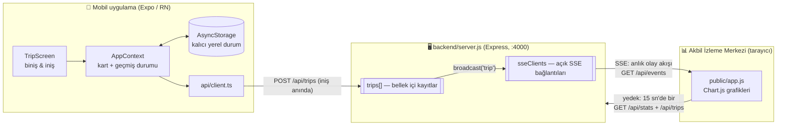

# Arnavutköy Belediyesi — Akbil Simülasyon Projesi

İki bölümden oluşur:

| Klasör | Ne yapar |
|---|---|
| `backend/` | Mobilden gelen yolculuk kayıtlarını alır ve **Akbil İzleme Merkezi** panelinde grafiklerle gösterir (Node.js + Express, bellek içi — veritabanı yok, ileride eklenecek) |
| `mobile/` | Akbil basmayı simüle eden mobil uygulama (Expo / React Native, TypeScript) |

## Sistem mimarisi

Üç parçalı, tek süreçli ve bilinçli olarak veritabanısız bir mimari:



### Veri akışı — bir yolculuğun hayatı

1. **Biniş (Kart Bas):** `AppContext.board()` bakiye ve aktif yolculuk kontrolü yapar,
   ücreti düşer, `activeTrip` oluşturur. Bu aşamada sunucuya hiçbir şey gitmez.
2. **İniş (İn ve Yolculuğu Bitir):** `AppContext.alight()` süreyi durak matrisi
   (`data/lines.ts`) üzerinden hesaplar, kaydı **önce yerel geçmişe** `pending`
   durumuyla yazar, sonra `postTrip()` ile `POST /api/trips` dener.
3. **Sunucu:** kaydı doğrular, `trips[]` dizisine ekler, `id` ve `receivedAt` damgalar
   ve **aynı anda** tüm açık SSE bağlantılarına `trip` olayını yayınlar.
4. **Panel:** `EventSource("/api/events")` ile dinler; olay gelir gelmez grafikleri ve
   "Son yolculuklar" tablosunu yeniler. SSE kopuksa 15 saniyelik yedek polling devreye
   girer; bağlantı geri gelince `open` olayında kaçan kayıtlar toparlanır.
5. **Hata yolu:** sunucuya ulaşılamazsa kayıt telefonda `pending` kalır, Geçmiş
   ekranındaki "Tekrar gönder" (`retryPending()`) ile yeniden denenir — veri kaybolmaz.

### API sözleşmesi

| Uç nokta | Metod | Görev |
|---|---|---|
| `/api/trips` | POST | İniş kaydını al, doğrula, belleğe yaz, SSE ile yayınla |
| `/api/trips?limit=N` | GET | Kayıtları **sunucuya geliş sırasına göre** (en yeni önce) döndür |
| `/api/trips` | DELETE | Tüm kayıtları sıfırla, panellere `reset` olayı yayınla |
| `/api/stats` | GET | Saatlik yoğunluk, hat/durak/kart tipi kırılımları, gelir toplamları |
| `/api/events` | GET | SSE canlı akışı: `trip` ve `reset` olayları + 30 sn'de bir nabız |
| `/api/health` | GET | Bağlantı testi (mobil Ayarlar ekranı kullanır) |

### Yolculuk kaydı (veri modeli)

| Alan | Tip | Açıklama |
|---|---|---|
| `id` | number | Sunucuda artan sıra no — geliş sırasını belirler |
| `cardNo` | string | Kart numarası (panelde maskelenir) |
| `cardType` | `"tam"` \| `"ogrenci"` | Ücret tarifesini belirler |
| `line` | string | Hat adı (ör. "448 Arnavutköy – Mecidiyeköy") |
| `boardingStop` / `alightingStop` | string | Biniş / iniş durağı |
| `boardTime` / `alightTime` | ISO-8601 | Biniş / hesaplanan iniş zamanı |
| `durationMin` | number | Duraklar arası sürelerin toplamı |
| `fare` | number | Düşülen ücret (₺) |
| `receivedAt` | ISO-8601 | Kaydın sunucuya ulaştığı an |

### Tasarım kararları

- **Veritabanı yok:** kayıtlar `trips[]` dizisinde tutulur; sunucu kapanınca silinir.
  Simülasyonun amacı canlı akışı göstermek olduğundan kalıcılık bilinçli ertelendi;
  mobil taraftaki `pending`/tekrar-gönder mekanizması geçici kesintileri zaten örter.
- **SSE (WebSocket değil):** veri tek yönlü aktığı için (sunucu → panel) SSE yeterli;
  ek bağımlılık gerektirmez, `EventSource` kopunca kendiliğinden yeniden bağlanır.
- **Panelde çifte güvence:** anlık SSE + 15 sn yedek polling; sağ üstteki rozet
  bağlantı durumunu gösterir ("Canlı" / "Bağlanıyor…").
- **Tek doğruluk kaynakları:** ücretler ve hat/durak/süre verileri yalnızca
  `mobile/src/data/lines.ts` içinde; kart durumu yalnızca telefonda (AsyncStorage).
- **CORS açık (`*`):** mobil uygulama Expo üzerinden farklı origin'den istek atar.

## 1. Backend'i başlat

```powershell
cd backend
npm install        # ilk seferde
npm start
```

- Panel: <http://localhost:4000>
- Açılışta konsolda **"Ağ (mobil): http://192.168.x.x:4000"** satırı görünür —
  telefonla test ederken bu adres mobil uygulamanın **Ayarlar** ekranına girilir.
- Panel yeni kayıtları **anında** gösterir (SSE canlı akış, `GET /api/events`);
  bağlantı koparsa sağ üstteki rozet "Bağlanıyor…" olur ve 15 saniyede bir
  yedek yenileme devreye girer. Grafikler: saatlik yoğunluk, hat kullanımı,
  en çok kullanılan duraklar, tam/öğrenci dağılımı + son yolculuklar.

Demo verisi doldurmak için (backend çalışırken, ikinci bir terminalde):

```powershell
cd backend
npm run seed        # 60 rastgele yolculuk; sayı verilebilir: npm run seed 100
```

Panelin sağ altındaki **"Verileri temizle"** tüm kayıtları sıfırlar.

## 2. Mobil uygulamayı başlat

```powershell
cd mobile
npm install        # ilk seferde
npx expo start
```

- **Telefonda**: Expo Go uygulamasını kurup terminaldeki QR kodu okutun.
  Ardından uygulamada **Ayarlar → İzleme merkezi adresi** alanına backend'in
  ağ adresini yazıp "Bağlantıyı Test Et" ile doğrulayın (telefon ve bilgisayar
  aynı Wi-Fi'da olmalı).
- **Bilgisayarda hızlı deneme**: `npx expo start --web` → tarayıcıda açılır;
  varsayılan adres `http://localhost:4000` bu modda doğrudan çalışır.

## Simülasyon kuralları

- **Kart Bas (Bin)**: biniş saati = o anki saat; kart tipine göre ücret düşer
  (Tam ₺20,00 / Öğrenci ₺9,76 — `mobile/src/data/lines.ts` içinde tek yerden).
- **İnmeden binilemez**: aktif yolculuk bitmeden yeni biniş engellenir.
- **İniş saati** seçilen durağa göre otomatik hesaplanır: biniş saati +
  duraklar arası sürelerin toplamı (hat/durak verileri `lines.ts`).
- Bakiye yetersizse biniş engellenir; **Kartım** ekranından bakiye yüklenir.
- İniş anında kayıt izleme merkezine gönderilir; sunucuya ulaşılamazsa
  **Geçmiş** ekranında "Bekliyor" olarak durur ve tekrar gönderilebilir.
- **Ayarlar → Demo saat modu**: grafiklerde farklı saatlere veri üretmek için
  biniş saatini elle seçme imkânı.

## Notlar

- Görsel kimlik arnavutkoy.bel.tr ile uyumludur (lacivert + turuncu, belediye
  logosu `backend/public/assets/` ve `mobile/assets/` altında).
- Veritabanı ve FastAPI bilinçli olarak yoktur; kayıtlar backend belleğinde
  tutulur ve sunucu yeniden başlatılınca silinir. API sözleşmesi:
  `POST /api/trips`, `GET /api/trips`, `GET /api/stats`, `GET /api/health`,
  `DELETE /api/trips`, `GET /api/events` (SSE canlı akış).
