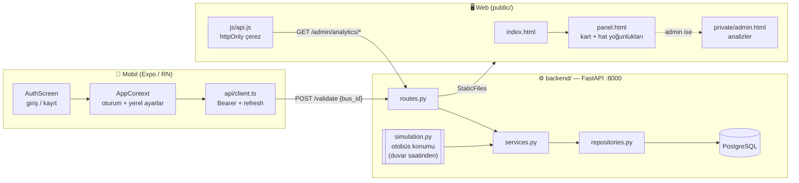
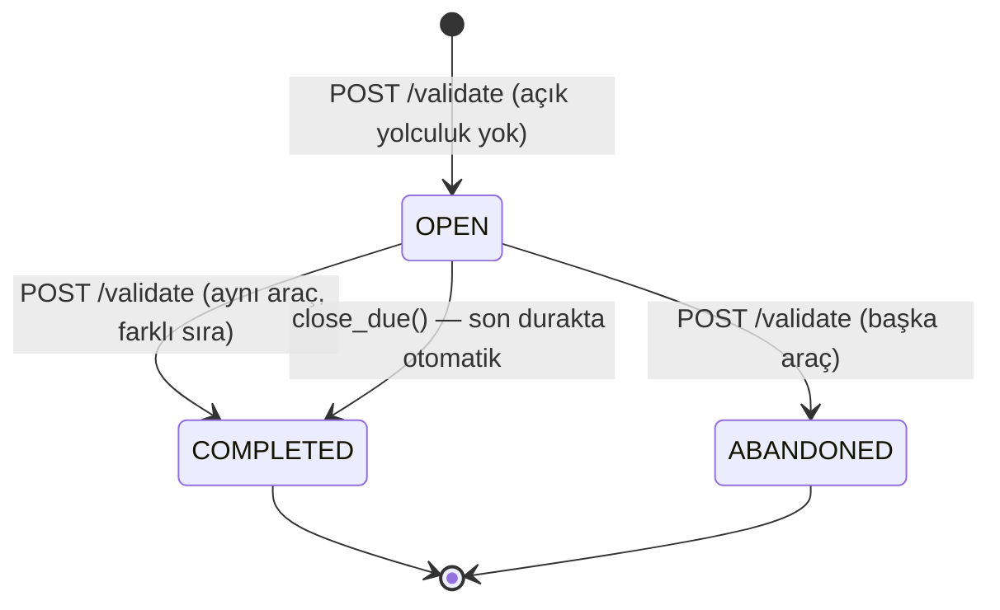

<div align="center">


# Arnavutköy Akbil — Toplu Ulaşım Simülasyon Sistemi

**Bir akbil kartının hayatını uçtan uca simüle eden üç parçalı sistem:**
mobil uygulamadan kart basılır, sunucu kuralları uygular, belediye hat
yoğunluğunu analiz eder.

`FastAPI` · `PostgreSQL 16` · `SQLAlchemy 2` · `Expo SDK 57` · `React Native 0.86` · `TypeScript`

[Kullanıcı Kılavuzu](docs/KULLANIM-KILAVUZU.md) ·
[Kurulum ve Senaryolar](docs/KULLANIM-SENARYOSU.md) ·
[API ve Mimari](docs/API-VE-MIMARI.md)

</div>

---

## İçindekiler

- [Ne yapar](#ne-yapar)
- [Dökümantasyon](#dökümantasyon)
- [Öne çıkan özellikler](#öne-çıkan-özellikler)
- [Sistem mimarisi](#sistem-mimarisi)
- [Bir yolculuğun hayatı](#bir-yolculuğun-hayatı)
- [Otobüs simülasyonu](#otobüs-simülasyonu)
- [API sözleşmesi](#api-sözleşmesi)
- [Yönetici koruması](#yönetici-koruması)
- [Yoğunluk renk kodu](#yoğunluk-renk-kodu)
- [Hızlı başlangıç](#hızlı-başlangıç)
- [Proje yapısı](#proje-yapısı)
- [Uygulama kuralları](#uygulama-kuralları)
- [Sorun giderme](#sorun-giderme)
- [Katkı](#katkı)
- [Lisans](#lisans)

---

## Ne yapar

Üç parçadan oluşur ve **tek doğruluk kaynağı backend'dir**: hat, durak, otobüs
konumu, yolculuk ve favori verisi yalnızca sunucuda yaşar; istemciler bunları
hesaplamaz, yalnızca gösterir.

| Klasör | Ne yapar |
|---|---|
| `backend/` | FastAPI + PostgreSQL. Kimlik doğrulama, otobüs simülasyonu, yolculuk kayıtları ve yönetim analitiği. Web sitesini de bu süreç servis eder. |
| `public/` | Web sitesi (saf HTML/CSS/JS). Giriş/kayıt ve yolcu paneli. Derleme adımı yoktur. |
| `private/` | Yönetim paneli. Statik kökün **dışındadır** — yetki kontrolünden sonra servis edilir. |
| `mobile/` | Akbil basmayı simüle eden mobil uygulama (Expo / React Native, TypeScript). Giriş zorunludur. |

> **Ücret ve bakiye kavramı yoktur.** Tam / Öğrenci / 65+ yalnızca statü
> farkıdır; hiçbir işlemde para geçmez.

## Dökümantasyon

Bu README hızlı bir başlangıç özetidir. Ayrıntı için `docs/` altındaki üç
dökümana bakın — her biri tek bir okuyucuya hizmet eder:

| Doküman | Kimin için | Ne anlatır |
|---|---|---|
| [**Kullanıcı Kılavuzu**](docs/KULLANIM-KILAVUZU.md) | Yolcu · Belediye yöneticisi | Ekran ekran kullanım, tüm düğmeler, hata mesajları sözlüğü, SSS, erişilebilirlik |
| [**Kullanım Senaryosu**](docs/KULLANIM-SENARYOSU.md) | Projeyi ilk kez kuran | GitHub'dan klonlama, adım adım kurulum, ağ sorun giderme, 5 uçtan uca senaryo |
| [**API ve Mimari**](docs/API-VE-MIMARI.md) | Kodu değiştirecek geliştirici | Katman mimarisi, dosya dosya satır referanslı rehber, 39 uç noktanın tamamı, simülasyon matematiği, teknik borç |

## Öne çıkan özellikler

| | Özellik | Nasıl çalışır |
|---|---|---|
| 🚌 | **Deterministik otobüs simülasyonu** | Araç konumu duvar saatinden hesaplanır; hiçbir durum saklanmaz, sunucu yeniden başlasa da aynı anda aynı sonucu verir |
| 🎫 | **Sunucu tarafından zorlanan biniş kuralı** | Durak istemciden gelmez; sunucu aracın o anki konumundan belirler. Araç durakta değilse istek 409 ile reddedilir |
| ⏱️ | **Otomatik iniş** | İnmeyi unutan yolcu son durakta otomatik indirilir. An, binişte damgalandığı için uygulama kapalıyken de doğru işler |
| 🔒 | **Üç katmanlı yönetici koruması** | Sayfa · API · UI. Adres çubuğuna elle yazmak işe yaramaz |
| 📊 | **Karar destekli analitik** | "Sefer artırılmalı / azaltılabilir" önerisi gerçek yolculuk kayıtlarından üretilir |
| 🌓 | **Tema ve dil** | Mobilde açık/koyu tema ve TR/EN; ikisi de yalnızca telefonda saklanır |
| ♿ | **Erişilebilirlik** | Renk asla tek başına anlam taşımaz — her yoğunluk göstergesinin metin etiketi vardır |
| 🔑 | **Oturum güvenliği** | Mobilde Bearer, web'de `httpOnly` çerez; tek doğrulama yolu. Refresh token tek kullanımlıktır |

## Sistem mimarisi



Katman zinciri kesindir: `routes.py → services.py → repositories.py → models.py`.
`commit` yalnızca servis katmanında çağrılır; `simulation.py` veritabanına hiç
dokunmaz. Ayrıntı: [Katman sözleşmesi](docs/API-VE-MIMARI.md#a2-katman-diyagramı).

## Bir yolculuğun hayatı

1. **Biniş:** Mobilde "Bin" → `POST /api/v1/validate {bus_id}`. Durak
   **gönderilmez**: sunucu, aracın o anki konumundan belirler. Araç durakta
   değilse istek 409 ile reddedilir — kural sunucuda zorlanır, istemci taklit
   edemez.
2. Sunucu `Trip` kaydını `OPEN` açar ve aracın son durağa varacağı anı
   `auto_alight_at` olarak damgalar.
3. **İniş:** Aynı uca ikinci kez basılır. Sunucu açık yolculuğu görür,
   `COMPLETED` yapar. Kayıt **iniş anında** yazılır; telefon geçmiş göndermez.
4. **İnilmezse:** `auto_alight_at` geçince arkaplan görevi
   (`TripService.close_due`) yolculuğu son durakta kapatır. Uygulama kapalıyken
   de doğru işler, çünkü an binişte hesaplanıp saklanmıştır.
5. **Geçmiş:** `GET /api/v1/trips` yalnızca giriş yapan kullanıcının kayıtlarını
   döndürür.



## Otobüs simülasyonu

Araç konumu **duvar saatinden deterministik** hesaplanır (`app/simulation.py`);
hiçbir durum saklanmaz. Tarife `LineStop.minutes_from_previous` alanından gelir.

- Hat başına **3 araç**, sefer döngüsüne eşit aralıklarla dağıtılır.
- Araç her durakta **3 sim-dakika** bekler (`SIM_SPEED=10` ile gerçek ~18 sn).
  Biniş ve iniş yalnızca bu pencerede yapılabilir.
- Son durakta **6 sim-dakika** mola verilir; bu sırada yolcu alınmaz.
- Gidiş ve dönüş tek döngüde birleşir; aracın o anki yönü saatten türetilir.
- `SIM_SPEED` çarpanı `.env` içindedir (10 → gerçek 30 sn ≈ 5 sim-dakika).

> **İpucu:** İlk denemenizde biniş penceresini kaçırmamak için `SIM_SPEED=2`
> yapın — pencere 18 saniye yerine 90 saniye olur.

Döngü matematiği ve sayısal örnek:
[Simülasyon bölümü](docs/API-VE-MIMARI.md#b8-appsimulationpy--134-satır).

## API sözleşmesi

Toplam **39 uç nokta** (37 API + 2 sistem). Taban: `/api/v1` ·
Etkileşimli döküman: `/docs`

| Grup | Uç | Görev |
|---|---|---|
| **auth** | 4 | `register` · `login` · `refresh` · `logout`. Login ayrıca httpOnly çerez basar (web için). |
| **passengers** | 2 | Oturum sahibinin bilgileri (`GET`/`PATCH /me`) |
| **cards** | 2 | Kullanıcının kartları · NFC kart bağlama |
| **transit** | 5 | Hatlar (+`hourly_profile`, `peak_hours`) · hat detayı · **canlı araç konumları** · hat durumu · durak arama |
| **favorites** | 3 | Favori hat ekle / listele / çıkar |
| **trips** | 2 | Kullanıcının kendi yolculukları · süren yolculuk |
| **validate** | 1 | **Kart bas** — biniş ya da iniş; hangisi olduğunu sunucu söyler |
| **admin** | 18 | analytics (overview · lines · stops · pairs · daily · card-types) · yolcu · kart · araç · doluluk · yolculuk yönetimi |
| **sistem** | 2 | `/health` · `/admin` (HTML sayfası) |

Kimlik iki yolla taşınır: **mobil** `Authorization: Bearer`, **web** httpOnly
`akbil_access` çerezi. Doğrulama tektir (`deps.get_current_passenger`).

Her uç noktanın istek/yanıt şeması, hata kodları ve `curl` örneği:
[API referansı](docs/API-VE-MIMARI.md#e-api-referansı--39-uç-nokta).

## Yönetici koruması

`/admin` sayfası iki katmanla korunur:

1. **Sayfa:** `GET /admin` FastAPI route'u çerezi doğrular. Yönetici değilse
   HTML hiç üretilmez, `/` adresine yönlendirilir — adres çubuğuna elle yazmak
   işe yaramaz. Sayfa dosyası bu yüzden `public/` altında değil, `private/`
   içindedir: statik kökte olsaydı `StaticFiles` onu doğrudan servis eder ve
   kontrol tamamen atlanırdı.
2. **Veri:** `/api/v1/admin/*` uçları `get_current_admin` ile 403 döner.

Üst banttaki "Yönetim" bağlantısı yalnızca `is_admin` doğruysa basılır; bu
sadece görsel kolaylıktır, güvenlik yukarıdaki iki katmandadır.

Yönetici hesabı **yalnızca** komut satırından üretilir; kayıt ucu asla yönetici
oluşturmaz.

## Yoğunluk renk kodu

Yönetim panelindeki yeşil/sarı/kırmızı kararı **sunucuda** verilir
(`load_level`), web yalnızca boyar. Renk tek başına anlam taşımasın diye her
yerde metin etiketiyle birlikte gösterilir.

- **Hat:** zirve saatteki biniş ÷ aktif otobüs, `BUS_CAPACITY`'ye oranla →
  `<%40` yeşil *"sefer azaltılabilir"* · `%40–75` normal · `>%75` kırmızı
  *"sefer artırılmalı"*.
- **Durak:** kullanım ÷ en yoğun durağın kullanımı → `<%35` yeşil · `%35–70`
  sarı · `>%70` kırmızı.

İki yoğunluk kavramı bilinçle ayrıdır: yolcuya gösterilen `Line.hourly_profile`
hattın **beklenen** profilidir (`lines.json`), yönetim analitiği ise **gerçek**
`Trip` kayıtlarından hesaplanır.

Formüller: [Analitik hesapları](docs/API-VE-MIMARI.md#c2-analitik-formülleri).

---

## Hızlı başlangıç

> Adım adım anlatım, ekran çıktıları ve sorun giderme için:
> [**Kullanım Senaryosu**](docs/KULLANIM-SENARYOSU.md)

**Ön koşullar:** Git · Python 3.12+ · Docker Desktop · Node.js 20+ ·
Expo Go (**SDK 57 uyumlu**)

### 1. Backend'i başlat

```powershell
git clone https://github.com/OFThub/AkBilSis.git
cd AkBilSis/backend

docker compose up -d          # PostgreSQL 16

python -m venv .venv
.\.venv\Scripts\Activate.ps1
pip install -r requirements.txt

copy .env.example .env        # SECRET_KEY değerini mutlaka değiştirin
alembic upgrade head
python -m app.seed            # 4 hat, 24 durak, 12 otobüs yükler

uvicorn app.main:app --reload --host 0.0.0.0 --port 8000
```

- Web sitesi: <http://localhost:8000>
- API dokümanı: <http://localhost:8000/docs>
- Bağlantı testi: <http://localhost:8000/health>
- `--host 0.0.0.0` telefonun bilgisayara ulaşabilmesi için gereklidir.

`SECRET_KEY` üretmek için:

```bash
python -c "import secrets; print(secrets.token_urlsafe(48))"
```

> `.env.example` içindeki `CARD_TOKEN_SECRET` satırı **kullanılmıyor** —
> `Settings` sınıfında karşılığı yoktur, görmezden gelebilirsiniz.

Yönetici hesabı (kayıt ucu asla yönetici üretmez, tek yol budur):

```powershell
python -m app.seed --admin admin@arnavutkoy.bel.tr Admin12345
```

Yönetim panelindeki grafikleri dolu görmek için 14 günlük demo verisi:

```powershell
python -m app.demo_seed       # ⚠️ mevcut TÜM yolculukları siler
```

### 2. Mobil uygulamayı başlat

```powershell
cd mobile
npm install        # ilk seferde
npm start
```

- **Telefonda (önerilen):** QR kodu **Expo Go** ile okutun. Telefon ve
  bilgisayar aynı Wi-Fi'da olmalı.
- **Bilgisayarda:** `npm run web`.

Backend adresi **elle girilmez**: uygulama, kendisini indirdiği Expo/Metro
sunucusunun adresinden türetir (aynı bilgisayar, port 8000). Böylece Wi-Fi ya da
DHCP adresi değiştiğinde hiçbir dosya güncellenmez. Adres açılışta Metro
günlüğüne yazılır: `[akbil] backend adresi: http://…:8000`.

Yalnızca backend **başka bir makinede** ya da başka bir portta çalışıyorsa
`mobile/.env` içindeki `EXPO_PUBLIC_BACKEND_URL` doldurulur. `.env` değişince
Metro önbelleğini temizleyin: `npx expo start -c`.

## Proje yapısı

```
AkBilSis/
├── backend/                  FastAPI sunucusu — web sitesini de o servis eder
│   ├── app/
│   │   ├── config.py         .env → Settings
│   │   ├── core.py           Base, enum'lar, hata sınıfları, JWT, bcrypt
│   │   ├── database.py       engine + SessionLocal + get_db
│   │   ├── models.py         8 ORM tablosu
│   │   ├── schemas.py        Pydantic giriş/çıkış modelleri
│   │   ├── repositories.py   Tüm SQL burada
│   │   ├── services.py       İş kuralları ve işlem sınırı
│   │   ├── simulation.py     Araç konumu — saf matematik, DB'ye dokunmaz
│   │   ├── deps.py           Kimlik çözümü (Bearer + çerez, tek yol)
│   │   ├── routes.py         8 router, 37 uç nokta
│   │   ├── main.py           Uygulama, arkaplan görevi, /admin koruması
│   │   ├── seed.py           Hat/durak/otobüs + yönetici oluşturma
│   │   └── demo_seed.py      14 günlük sahte yolculuk üretici
│   ├── alembic/versions/     0001…0005 şema göçleri
│   ├── lines.json            4 hat, 24 durak tanımı
│   └── docker-compose.yml    PostgreSQL 16
├── public/                   Web sitesi — derleme adımı yok
│   ├── index.html            Giriş / kayıt
│   ├── panel.html            Yolcu paneli
│   ├── js/                   api · auth · charts · panel · admin
│   └── vendor/               Chart.js gömülü
├── private/admin.html        Yönetim paneli — statik kökün DIŞINDA
├── mobile/src/               api · components · config · context · hooks · i18n · screens · utils
└── docs/                     Kullanıcı kılavuzu · kullanım senaryosu · API/mimari
```

## Uygulama kuralları

- **Giriş zorunludur.** Kullanıcı listesi, demo kipi ve geliştirici ayarları
  kaldırıldı — uygulamaya yalnızca hesapla girilir.
- **Yalnızca duraktaki araca binilir/inilir.** Durak seçilmez; kayda aracın o an
  beklediği durak yazılır. Kuralı sunucu uygular.
- **İnmeden binilemez:** kişi başına aynı anda tek açık yolculuk olur. Bu kısıt
  veritabanında kısmi benzersiz indeksle zorlanır. Başka araca binilirse önceki
  yolculuk "yarıda kaldı" (`ABANDONED`) sayılır.
- **Aynı durakta inilemez:** ölçüt durağın adı değil, güzergâhtaki sırasıdır —
  araç tur atıp aynı durağa dönerse inilebilir.
- **Son durakta otomatik iniş** yolcu inmeyi unutursa devreye girer.
- **Ücret/bakiye kavramı yoktur:** tam, öğrenci ve 65+ yalnızca statü farkıdır.
  Kart tipi **kayıt sırasında beyan edilir** (web ve mobilde seçim). Beyan
  doğrulanmaz — belge kontrolü belediyede yapılır ve yönetici
  `PATCH /admin/cards/{id}/type` ile düzeltebilir. Süren yolculuklar
  etkilenmez, çünkü tip biniş anında `card_type_snapshot` olarak damgalanır.
- **Ayarlar ekranı sunucuya hiç istek atmaz:** yalnızca tema (açık/koyu) ve dil
  (TR/EN) seçimi vardır ve bunlar telefonda saklanır.

## Sorun giderme

En sık iki sorun ve hızlı çözümü:

| Belirti | Sebep | Çözüm |
|---|---|---|
| Uygulama **hiç açılmıyor** (QR'da IOException) | Expo Go sürümü SDK 57 değil **ya da** telefon bilgisayara ulaşamıyor (Wi-Fi istemci yalıtımı) | SDK 57 uyumlu Expo Go kurun; aynı Wi-Fi'da olun ya da telefonun hotspot'unu kullanın |
| Uygulama açılıyor, **"Sunucuya ulaşılamadı"** | Backend çalışmıyor **veya** 8000 portu güvenlik duvarında kapalı | Aşağıdaki iki adım |

**1. Backend gerçekten dinliyor mu?**

```powershell
Get-NetTCPConnection -State Listen | Where-Object LocalPort -eq 8000
```

Boş dönerse uvicorn çalışmıyordur. `--host 0.0.0.0` ile başlatın; `127.0.0.1`
ile başlatılırsa yalnızca bilgisayarın kendisi erişebilir.

**2. Güvenlik duvarı 8000'e izin veriyor mu?**

Windows kuralları **dosya yoluna** göredir: sistem python'una verilmiş bir izin
`backend\.venv\Scripts\python.exe` için geçerli değildir. Port bazlı kural bu
yüzden gerekir (yönetici PowerShell):

```powershell
New-NetFirewallRule -DisplayName "AkBil backend 8000" `
  -Direction Inbound -Protocol TCP -LocalPort 8000 `
  -Action Allow -Profile Private,Public
```

Geri almak için: `Remove-NetFirewallRule -DisplayName "AkBil backend 8000"`

Doğrulama: telefonun tarayıcısında `http://<bilgisayar-ip>:8000/health` adresini
açın. `{"status":"ok"}` görünüyorsa ağ yolu tamamdır.

Kurulum, çalışma anı ve mobil hatalarının tam listesi:
[Sık karşılaşılan hatalar](docs/KULLANIM-SENARYOSU.md#16-sık-karşılaşılan-hatalar).

## Katkı

```bash
git checkout -b ozellik/kisa-aciklama
# … değişiklikleri yapın …
git commit -m "Kısa ve açıklayıcı mesaj"
git push -u origin ozellik/kisa-aciklama
```

Kod değiştirirken katman zincirini bozmayın:

| Yapmayın | Neden |
|---|---|
| `routes.py` içine iş kuralı yazmak | Kural test edilemez hâle gelir |
| `services.py` içine ham SQL yazmak | Sorgu tek yerde toplanamaz |
| `repositories.py` içinde `commit` çağırmak | Servis birden çok işlemi tek işlemde toplayamaz |
| `simulation.py` içinden veritabanına dokunmak | Saf matematik olma özelliği kaybolur |

Şema değişikliği için `alembic revision -m "aciklama"`, hat/durak değişikliği
için `lines.json` düzenleyip `python -m app.seed`. Ayrıntı:
[Geliştirme akışı](docs/KULLANIM-SENARYOSU.md#17-geliştirme-akışı).

Bilinen teknik borç ve tuhaflıklar dökümante edilmiştir:
[Bölüm I](docs/API-VE-MIMARI.md#i-bilinen-tuhaflıklar-ve-teknik-borç).

## Notlar

- Görsel kimlik arnavutkoy.bel.tr ile uyumludur (lacivert + turuncu). Belediye
  logoları `public/assets/` ve `mobile/assets/` altındadır.
- Chart.js `public/vendor/` içine gömülüdür; web tarafında npm bağımlılığı ve
  derleme adımı yoktur.
- Web sitesi backend ile **aynı origin**'den servis edilir; bu yüzden CORS
  gerekmez ve `/admin` sayfası sunucuda korunabilir. `CORS_ORIGINS` yalnızca
  mobil gibi harici istemciler içindir.
- Analitik `Europe/Istanbul` saat diliminde gruplanır (`ANALYTICS_TIMEZONE`);
  zaman damgaları UTC saklanır.

## Lisans

Depo kökünde bir lisans dosyası **bulunmamaktadır** — proje için lisans henüz
belirlenmemiştir. `mobile/LICENSE` dosyası Expo başlangıç şablonundan gelen MIT
metnidir ve bu projenin lisansını temsil etmez.

---

<div align="center">

**Arnavutköy Belediyesi — Akbil Simülasyon Projesi**

</div>
