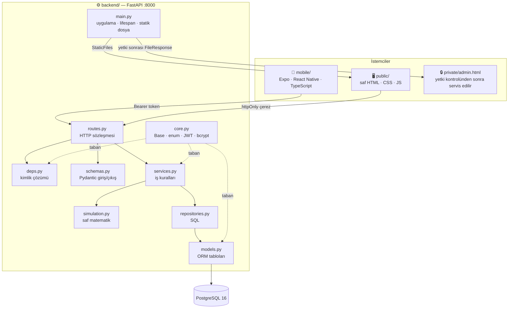
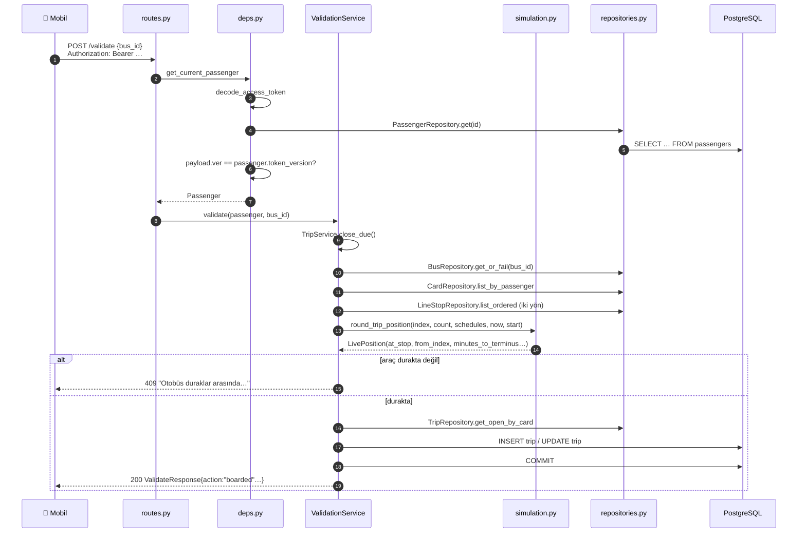
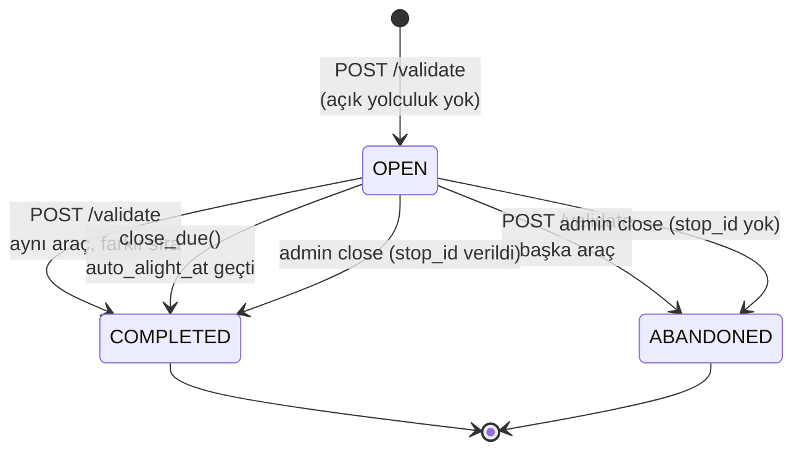
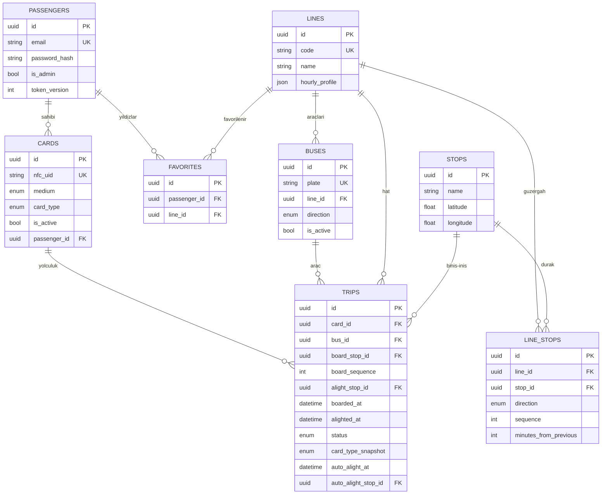
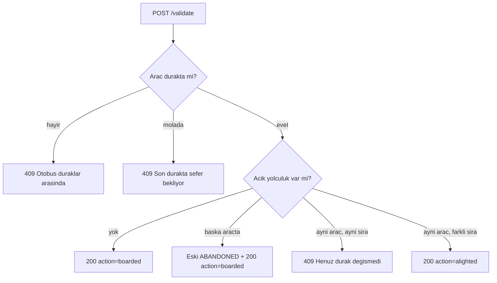

# API ve Mimari Dökümantasyonu

**Arnavutköy Belediyesi — Akbil Simülasyon Sistemi**

Bu doküman kodu değiştirecek geliştirici içindir. Sistemin mimarisini, her
dosyanın görevini, her sınıf ve fonksiyonun ne yaptığını satır referanslarıyla
anlatır; ardından 39 uç noktanın tamamını sözleşme düzeyinde belgeler.

| Ne arıyorsanız | Nereye bakın |
|---|---|
| Uygulamayı kullanmak | [Kullanıcı Kılavuzu](KULLANIM-KILAVUZU.md) |
| Kurmak / çalıştırmak | [Kullanım Senaryosu](KULLANIM-SENARYOSU.md) |
| Kodun iç işleyişi | **bu doküman** |

---

## İçindekiler

**A.** [Sistem mimarisi](#a-sistem-mimarisi)
**B.** [Backend dosya rehberi](#b-backend-dosya-rehberi)
**C.** [Veri modeli ve analitik hesapları](#c-veri-modeli-ve-analitik-hesapları)
**D.** [Kimlik doğrulama ve güvenlik](#d-kimlik-doğrulama-ve-güvenlik)
**E.** [API referansı — 39 uç nokta](#e-api-referansı--39-uç-nokta)
**F.** [Web istemci rehberi](#f-web-istemci-rehberi)
**G.** [Mobil istemci rehberi](#g-mobil-istemci-rehberi)
**H.** [Yapılandırma referansı](#h-yapılandırma-referansı)
**I.** [Bilinen tuhaflıklar ve teknik borç](#i-bilinen-tuhaflıklar-ve-teknik-borç)

---

# A. Sistem mimarisi

## A.1 Temel ilke: tek doğruluk kaynağı backend'dir

Hat, durak, otobüs konumu, yolculuk ve favori verisi **yalnızca sunucuda**
yaşar. İstemciler bunları hesaplamaz, üretmez, önbelleğe almaz — yalnızca
gösterir. Bu ilkenin somut sonuçları:

| Karar | Sonuç |
|---|---|
| Araç konumu sunucuda hesaplanır | Telefon saati değiştirilse bile konum kaymaz |
| Biniş durağını sunucu belirler | İstemci "şu durakta bindim" diyemez |
| Yolculuk kaydı iniş anında sunucuda yazılır | Telefon geçmiş göndermez, sahte kayıt üretilemez |
| Otomatik iniş anı binişte damgalanır | Uygulama kapalıyken de doğru çalışır |
| Yoğunluk renk kararı (`load_level`) sunucuda verilir | İki istemci aynı veriyi farklı yorumlayamaz |

## A.2 Katman diyagramı



### Katman sözleşmesi

| Katman | Yapar | **Yapmaz** |
|---|---|---|
| `routes.py` | HTTP metodu/yolu tanımlar, şema bağlar, servisi çağırır | İş kuralı içermez, SQL yazmaz |
| `services.py` | İş kuralları, doğrulama, işlem (transaction) sınırı | Ham SQL yazmaz, HTTP bilmez |
| `repositories.py` | Sorgu kurar ve çalıştırır | İş kuralı içermez, `commit` etmez |
| `models.py` | Tablo yapısı ve ilişkiler | Davranış içermez |
| `simulation.py` | Saf matematik | Veritabanına dokunmaz, durum saklamaz |
| `schemas.py` | Sınırdaki veri biçimi | İş mantığı içermez |

**Kritik kural:** `commit` yalnızca servis katmanında çağrılır. Repository'ler
`flush()` yapar; böylece bir servis birden çok repository işlemini tek işlemde
toplayabilir. Örnek: `AuthService.register`
([services.py:99-109](../backend/app/services.py#L99-L109)) yolcuyu ve kartı
ekler, **tek** `commit` ile ikisini birden yazar.

## A.3 Bir isteğin yaşam döngüsü

`POST /api/v1/validate` örneği üzerinden:



## A.4 Bir yolculuğun hayatı



## A.5 Varlık ilişkileri (ER)



## A.6 Dizin haritası

```
AkBilSis/
├── backend/                    FastAPI sunucusu — web sitesini de o servis eder
│   ├── app/
│   │   ├── config.py           .env → Settings
│   │   ├── core.py             Base, enum'lar, hata sınıfları, JWT, bcrypt
│   │   ├── database.py         engine + SessionLocal + get_db
│   │   ├── models.py           8 ORM tablosu
│   │   ├── schemas.py          40 Pydantic modeli
│   │   ├── repositories.py     9 repository sınıfı
│   │   ├── services.py         8 servis sınıfı
│   │   ├── simulation.py       araç konumu — saf matematik
│   │   ├── deps.py             FastAPI bağımlılıkları (kimlik)
│   │   ├── routes.py           8 router, 37 uç nokta
│   │   ├── main.py             uygulama nesnesi, arkaplan görevi, statik dosya
│   │   ├── seed.py             hat/durak/otobüs yükleme + yönetici oluşturma
│   │   └── demo_seed.py        14 günlük sahte yolculuk üretici
│   ├── alembic/versions/       0001…0005 şema göçleri
│   ├── lines.json              4 hat, 24 durak tanımı
│   ├── docker-compose.yml      PostgreSQL 16
│   └── requirements.txt
├── public/                     Web sitesi — derleme adımı yok
│   ├── index.html              giriş / kayıt
│   ├── panel.html              yolcu paneli
│   ├── js/{api,auth,charts,panel,admin}.js
│   ├── style.css
│   └── vendor/chart.umd.js     Chart.js gömülü
├── private/admin.html          Yönetim paneli — statik kökün DIŞINDA
├── mobile/                     Expo / React Native
│   └── src/{api,components,config,context,hooks,i18n,screens,utils}
└── docs/                       bu dökümanlar
```

---

# B. Backend dosya rehberi

Her dosya için: **Görevi → Bağımlılıkları → Blok blok açıklama → Dikkat.**

---

## B.1 `app/config.py` — 39 satır

**Görevi:** `.env` dosyasını ve ortam değişkenlerini tipli bir `Settings`
nesnesine çevirmek.

**Bağımlılıkları:** `pydantic_settings`. Başka hiçbir uygulama modülüne bağımlı
değildir — bu yüzden her modül onu güvenle içe aktarabilir.

| Satır | Ne yapar |
|---|---|
| [7-12](../backend/app/config.py#L7-L12) | `model_config`: `.env` dosyasını UTF-8 okur, büyük/küçük harf duyarsızdır, **tanımsız anahtarları sessizce yok sayar** (`extra="ignore"`) |
| [14-16](../backend/app/config.py#L14-L16) | `app_name`, `api_prefix="/api/v1"`, `debug` |
| [18-19](../backend/app/config.py#L18-L19) | `database_url` — **varsayılanı yoktur**, `.env`'de zorunludur; yoksa uygulama açılışta patlar |
| [21-24](../backend/app/config.py#L21-L24) | `secret_key` (zorunlu), `jwt_algorithm="HS256"`, token ömürleri |
| [26](../backend/app/config.py#L26) | `analytics_timezone="Europe/Istanbul"` — saatlik/günlük analitik bu saat diliminde gruplanır |
| [29-30](../backend/app/config.py#L29-L30) | `sim_speed=10.0`, `bus_capacity=40` |
| [32](../backend/app/config.py#L32) | `cors_origins=["*"]` |
| [35-37](../backend/app/config.py#L35-L37) | `get_settings()` — `@lru_cache` ile tek örnek üretir |
| [40](../backend/app/config.py#L40) | `settings` modül düzeyinde çözülür; içe aktaran her yer aynı nesneyi görür |

> ⚠️ **Dikkat:** `extra="ignore"` yüzünden `.env`'e yazdığınız yanlış isimli bir
> anahtar hata vermez, sessizce yok sayılır. `CARD_TOKEN_SECRET` tam olarak bu
> duruma düşmüştür → [Bölüm I](#i-bilinen-tuhaflıklar-ve-teknik-borç).

---

## B.2 `app/core.py` — 152 satır

**Görevi:** Tüm katmanların paylaştığı taban: ORM `Base`, mixin'ler, enum'lar,
hata hiyerarşisi, parola karma ve JWT işlemleri.

| Satır | Blok | Açıklama |
|---|---|---|
| [15-16](../backend/app/core.py#L15-L16) | `Base` | SQLAlchemy 2.0 `DeclarativeBase`. Tüm modeller bundan türer; Alembic `Base.metadata` üzerinden şemayı görür |
| [19-22](../backend/app/core.py#L19-L22) | `UUIDMixin` | `id` birincil anahtarı — `uuid4` ile **uygulama tarafında** üretilir; `flush` öncesi kimlik bilinir, iç içe ekleme kolaylaşır |
| [25-31](../backend/app/core.py#L25-L31) | `TimestampMixin` | `created_at` / `updated_at`, `server_default=now()` ve `onupdate` ile — saat sunucudan gelir |
| [34-35](../backend/app/core.py#L34-L35) | `SoftDeleteMixin` | `is_deleted` bayrağı. Kayıt fiziksel silinmez; `BaseRepository._base_query` bunu otomatik süzer |
| [38-42](../backend/app/core.py#L38-L42) | `CardType` | `NORMAL` · `STUDENT` · `SENIOR` |
| [44-46](../backend/app/core.py#L44-L46) | `CardMedium` | `PHYSICAL` · `MOBILE` |
| [49-52](../backend/app/core.py#L49-L52) | `TripStatus` | `OPEN` · `COMPLETED` · `ABANDONED` |
| [55-57](../backend/app/core.py#L55-L57) | `Direction` | `FORWARD` · `BACKWARD` |
| [60-62](../backend/app/core.py#L60-L62) | `TokenType` | `ACCESS` · `REFRESH` — token karışmasını önler |
| [65-70](../backend/app/core.py#L65-L70) | `AppError` | Taban hata; `status_code=400`, `message` taşır |
| [73-86](../backend/app/core.py#L73-L86) | Alt hatalar | `NotFoundError`=404 · `ConflictError`=409 · `AuthError`=401 · `ForbiddenError`=403 |

**Parola işlemleri**

| Satır | Açıklama |
|---|---|
| [90](../backend/app/core.py#L90) | `_BCRYPT_MAX_BYTES = 72` — bcrypt algoritmasının sabit sınırı |
| [93-94](../backend/app/core.py#L93-L94) | `hash_password`: girdiyi **72 bayta kırpar**, `bcrypt.gensalt()` ile karmalar |
| [97-101](../backend/app/core.py#L97-L101) | `verify_password`: aynı kırpmayı uygular; bozuk karma `ValueError` verirse `False` döner — patlamaz |

> **Neden passlib yok?** `requirements.txt` açıklıyor: passlib, Python 3.13'te
> kaldırılan `crypt` modülüne bağımlı. Bu yüzden doğrudan `bcrypt` API'si
> çağrılıyor.

**JWT işlemleri**

| Satır | Açıklama |
|---|---|
| [104-111](../backend/app/core.py#L104-L111) | `_encode`: yükü `iat`, `exp` ve rastgele `jti` ile zenginleştirip imzalar |
| [114-123](../backend/app/core.py#L114-L123) | `_decode`: imzayı doğrular; her `JWTError`'ı Türkçe `AuthError`'a çevirir; **`type` alanı beklenene uymazsa reddeder** — refresh token'la API çağrısı yapılamaz |
| [126-136](../backend/app/core.py#L126-L136) | `create_access_token`: `sub`, `admin`, `ver`, `type=access` |
| [139-144](../backend/app/core.py#L139-L144) | `create_refresh_token`: `sub`, `ver`, `type=refresh` |
| [147-152](../backend/app/core.py#L147-L152) | Çözücü sarmalayıcılar |

---

## B.3 `app/database.py` — 26 satır

| Satır | Açıklama |
|---|---|
| [8-12](../backend/app/database.py#L8-L12) | `engine`: `pool_pre_ping=True` — havuzdaki ölü bağlantı kullanılmadan önce sınanır; Docker'daki Postgres yeniden başlasa da ilk istek patlamaz |
| [14-19](../backend/app/database.py#L14-L19) | `SessionLocal`: `autoflush=False` (beklenmedik ara yazma olmaz), `expire_on_commit=False` — **kritik**: `commit` sonrası nesne alanları hâlâ okunabilir, yoksa yanıt üretirken ikinci bir SELECT tetiklenirdi |
| [22-26](../backend/app/database.py#L22-L26) | `get_db()`: FastAPI bağımlılığı; istek bitince `finally` ile oturumu kapatır |

---

## B.4 `app/models.py` — 133 satır

8 tablo. Sütun sözlüğü için → [Bölüm C.1](#c1-tablo-sözlüğü).

| Satır | Model | Öne çıkanlar |
|---|---|---|
| [29-39](../backend/app/models.py#L29-L39) | `Passenger` | `email` benzersiz + indeksli; `is_admin`; `token_version` (varsayılan 0) |
| [41-51](../backend/app/models.py#L41-L51) | `Card` | `nfc_uid` **null olabilir** ama doluysa benzersiz — mobil kartların NFC kimliği yoktur; `passenger_id` null olabilir (sahipsiz kart üretilebilir) |
| [53-63](../backend/app/models.py#L53-L63) | `Line` | `hourly_profile` JSON dizisi; `line_stops` ilişkisi `sequence`'a göre sıralı gelir |
| [65-72](../backend/app/models.py#L65-L72) | `Stop` | Ad + koordinat. Durak hatlara ait değildir, hatlar durakları paylaşır |
| [75-89](../backend/app/models.py#L75-L89) | `LineStop` | Hat↔durak bağı. **İki benzersizlik kısıtı**: `(line, direction, sequence)` ve `(line, direction, stop)` — aynı sırada iki durak ya da aynı yönde iki kez aynı durak olamaz. `minutes_from_previous` tarifenin kaynağıdır |
| [92-101](../backend/app/models.py#L92-L101) | `Bus` | `direction` aracın **sefere başladığı** yöndür, o anki yönü değil — o anki yön saatten türetilir |
| [104-122](../backend/app/models.py#L104-L122) | `Trip` | 12 alan; `board_sequence`, `card_type_snapshot`, `auto_alight_at`/`auto_alight_stop_id`. `board_stop` ve `alight_stop` ilişkileri `foreign_keys=` ile ayrıştırılır (ikisi de `stops`'a bakar) |
| [125-133](../backend/app/models.py#L125-L133) | `Favorite` | `(passenger_id, line_id)` benzersiz — aynı hat iki kez favorilenemez |

> **`SoftDeleteMixin` kimde yok?** `LineStop` ve `Favorite`. İkisi de saf bağ
> tablosudur; silinmeleri gerçekten silme anlamına gelir.

---

## B.5 `app/schemas.py` — 297 satır

Pydantic v2 modelleri. `ORMModel` ([9-10](../backend/app/schemas.py#L9-L10))
`from_attributes=True` taşır; ORM nesnesi doğrudan yanıta dönüştürülebilir.

### Girdi şemaları

| Satır | Şema | Doğrulama |
|---|---|---|
| [13-24](../backend/app/schemas.py#L13-L24) | `RegisterRequest` | `full_name` 2-100; `email` EmailStr; `password` ≥8; `card_type` varsayılan `normal`. [19-24](../backend/app/schemas.py#L19-L24) alan doğrulayıcısı **72 baytı** reddeder |
| [27-29](../backend/app/schemas.py#L27-L29) | `LoginRequest` | e-posta + parola |
| [32-33](../backend/app/schemas.py#L32-L33) | `RefreshRequest` | `refresh_token` |
| [50-51](../backend/app/schemas.py#L50-L51) | `PassengerUpdate` | yalnız `full_name`, null olabilir |
| [64-68](../backend/app/schemas.py#L64-L68) | `CardCreate` | yönetici kart üretimi |
| [71-72](../backend/app/schemas.py#L71-L72) | `CardLinkRequest` | `nfc_uid` 4-32 |
| [75-77](../backend/app/schemas.py#L75-L77) | `CardTypeUpdate` | tek alan: `card_type` |
| [115-118](../backend/app/schemas.py#L115-L118) | `BusCreate` | `plate` 5-16 |
| [139-140](../backend/app/schemas.py#L139-L140) | `FavoriteCreate` | `line_id` |
| [171-173](../backend/app/schemas.py#L171-L173) | `ValidateRequest` | **yalnızca `bus_id`** — durak gönderilmez, kural budur |

### Çıktı şemaları

| Satır | Şema | Not |
|---|---|---|
| [36-39](../backend/app/schemas.py#L36-L39) | `TokenPair` | `access_token`, `refresh_token`, `token_type="bearer"` |
| [42-47](../backend/app/schemas.py#L42-L47) | `PassengerRead` | **`password_hash` ve `token_version` yoktur** — dışarı sızmaz |
| [54-61](../backend/app/schemas.py#L54-L61) | `CardRead` | |
| [94-100](../backend/app/schemas.py#L94-L100) | `LineRead` | `hourly_profile` + `peak_hours`. `peak_hours` tabloda **yoktur**, servis çalışma anında iliştirir |
| [103-104](../backend/app/schemas.py#L103-L104) | `LineDetail` | `LineRead` + sıralı `line_stops` |
| [157-168](../backend/app/schemas.py#L157-L168) | `BusLive` | Canlı konum: `at_stop`, `layover`, `direction`, `current_stop`, `next_stop`, `minutes_to_next`, `passenger_count` |
| [176-182](../backend/app/schemas.py#L176-L182) | `ValidateResponse` | `action` (`boarded`/`alighted`), `trip_id`, `stop_name`, `occurred_at` |
| [121-136](../backend/app/schemas.py#L121-L136) | `TripRead` / `TripDetail` | Detay sürümü hat ve durak nesnelerini gömer |
| [205-226](../backend/app/schemas.py#L205-L226) | `HourlyBoarding`, `DailyBoarding`, `DailyTrend`, `StopBoarding` | Analitik yapı taşları |
| [240-297](../backend/app/schemas.py#L240-L297) | `AnalyticsOverview`, `LineAnalytics`, `StopAnalytics`, `StopPair`, `CardTypeShare`, `RecentTrip` | Yönetim paneli sözleşmesi |

---

## B.6 `app/repositories.py` — 471 satır

**Görevi:** Tüm SQL burada. Servisler sorgu yazmaz.

### `BaseRepository` — [24-67](../backend/app/repositories.py#L24-L67)

Generic taban sınıf (`Generic[T]`).

| Satır | Metod | Açıklama |
|---|---|---|
| [30-34](../backend/app/repositories.py#L30-L34) | `_base_query` | `select(model)` üretir ve **model `is_deleted` taşıyorsa otomatik süzer**. Yumuşak silme buradan tek noktadan uygulanır |
| [36-38](../backend/app/repositories.py#L36-L38) | `get` | Kimlikle tek kayıt, yoksa `None` |
| [40-44](../backend/app/repositories.py#L40-L44) | `get_or_fail` | Yoksa `NotFoundError(f"{model.__name__} bulunamadı")` — mesajdaki sınıf adı İngilizcedir (*"Bus bulunamadı"*) |
| [46-48](../backend/app/repositories.py#L46-L48) | `list` | `offset`/`limit` sayfalama |
| [50-53](../backend/app/repositories.py#L50-L53) | `add` | `add` + **`flush`** — kimlik üretilir ama işlem kapanmaz |
| [55-59](../backend/app/repositories.py#L55-L59) | `update` | Alanları atar, `flush` |
| [61-63](../backend/app/repositories.py#L61-L63) | `soft_delete` | `is_deleted=True` |
| [65-67](../backend/app/repositories.py#L65-L67) | `hard_delete` | Gerçekten siler (favoriler için) |

### `PassengerRepository` — [70-92](../backend/app/repositories.py#L70-L92)

`email_taken` ([73-75](../backend/app/repositories.py#L73-L75)) — dikkat:
`_base_query` **kullanmaz**, yani yumuşak silinmiş yolcunun e-postası da
"alınmış" sayılır. Benzersizlik kısıtıyla çakışmayı önler.
`search` ([81-92](../backend/app/repositories.py#L81-L92)) ad veya e-postada
küçük harfe indirgenmiş `LIKE` araması yapar.

### `CardRepository` — [95-112](../backend/app/repositories.py#L95-L112)

`list_by_passenger` ([106-112](../backend/app/repositories.py#L106-L112))
`created_at, id` ile sıralar — **kararlı sıra** şart, çünkü
`ValidationService._resolve_card` listenin ilk kartını kullanır.

### `LineRepository` — [115-132](../backend/app/repositories.py#L115-L132)

`get_with_stops` ([122-132](../backend/app/repositories.py#L122-L132)):
`selectinload(Line.line_stops.and_(LineStop.direction == direction))` ile
**yalnızca istenen yönün** durakları yüklenir; ilişki üzerinde koşullu yükleme
sayesinde N+1 sorgu olmaz.

### `StopRepository` — [135-148](../backend/app/repositories.py#L135-L148)

`search` ([142-148](../backend/app/repositories.py#L142-L148)) en fazla 20 sonuç.

### `LineStopRepository` — [151-180](../backend/app/repositories.py#L151-L180)

`list_ordered` ([154-161](../backend/app/repositories.py#L154-L161)) —
**simülasyonun girdisi**. `sequence`'a göre sıralı, `stop` ilişkisi önceden
yüklenmiş `LineStop` listesi verir.

### `BusRepository` — [183-202](../backend/app/repositories.py#L183-L202)

`list_by_line(line_id, only_active=True)` — `only_active=False` çağrısı
önemlidir: faz hesabında **pasif araçlar da sayılır**, yoksa bir araç pasife
alındığında diğerlerinin konumu zıplardı
([services.py:268](../backend/app/services.py#L268),
[services.py:385](../backend/app/services.py#L385)).

### `TripRepository` — [205-453](../backend/app/repositories.py#L205-L453)

En yoğun repository.

| Satır | Metod | Açıklama |
|---|---|---|
| [208-210](../backend/app/repositories.py#L208-L210) | `_live` | Toplu sorgularda `is_deleted=False` süzgeci (bunlar `select(Trip)` değil, sütun seçtiği için `_base_query` kullanılamaz) |
| [212-219](../backend/app/repositories.py#L212-L219) | `_in_range` | `since`/`until` ile `boarded_at` aralığı ekler |
| [221-225](../backend/app/repositories.py#L221-L225) | `_local_hour` | `extract('hour', timezone('Europe/Istanbul', boarded_at))` — **UTC saklanan zaman yerel saate çevrilip gruplanır**; aksi hâlde "en yoğun saat" 3 saat kayardı |
| [227-231](../backend/app/repositories.py#L227-L231) | `get_open_by_card` | Kartın açık yolculuğu |
| [233-243](../backend/app/repositories.py#L233-L243) | `list_open_by_bus` | Araçtaki yolcular, kart→yolcu ilişkisi önceden yüklü |
| [245-263](../backend/app/repositories.py#L245-L263) | `list_by_cards` | Yolcunun tüm kartlarının yolculukları, **tek sorguda** sayfalanmış |
| [264-270](../backend/app/repositories.py#L264-L270) | `count_open_by_bus` | `{bus_id: yolcu}` sözlüğü — canlı araç listesi bunu kullanır |
| [278-284](../backend/app/repositories.py#L278-L284) | `count_by_status` | Durum→sayı |
| [286-295](../backend/app/repositories.py#L286-L295) | `hourly_boardings` | Yerel saate göre 24'lük dağılım |
| [297-306](../backend/app/repositories.py#L297-L306) | `daily_boardings` | Yerel güne göre dağılım |
| [308-325](../backend/app/repositories.py#L308-L325) | `top_board_stops` | En çok biniş yapılan duraklar |
| [327-338](../backend/app/repositories.py#L327-L338) | `hourly_by_line` | `(line_id, saat, sayı)` — hat zirve saati bundan çıkar |
| [340-346](../backend/app/repositories.py#L340-L346) | `count_by_line` | Hat→toplam |
| **[348-397](../backend/app/repositories.py#L348-L397)** | **`stop_usage`** | Aşağıda ayrıntılı |
| [399-422](../backend/app/repositories.py#L399-L422) | `top_pairs` | `aliased(Stop)` ile **iki kez** `stops`'a JOIN; yalnız `COMPLETED` sayılır |
| [424-430](../backend/app/repositories.py#L424-L430) | `count_by_card_type` | `card_type_snapshot`'a göre |
| [432-445](../backend/app/repositories.py#L432-L445) | `recent` | Son N yolculuk, 5 ilişki önceden yüklü |
| [447-453](../backend/app/repositories.py#L447-L453) | `list_due` | `status=OPEN` **ve** `auto_alight_at <= now` — otomatik iniş kuyruğu |

#### `stop_usage` neden `union_all` kullanır?

Bir durak hem biniş hem iniş noktası olabilir. Tek sorguda `board_stop_id` ve
`alight_stop_id` üzerinden iki kez JOIN yapılsa satırlar **çarpılırdı**
(kartezyen etki). Çözüm:

1. [356-364](../backend/app/repositories.py#L356-L364) — Binişler:
   `(stop_id, boarding=COUNT, alighting=0)`
2. [366-378](../backend/app/repositories.py#L366-L378) — İnişler:
   `(stop_id, boarding=0, alighting=COUNT)`, `alight_stop_id IS NOT NULL` süzgeciyle
3. [380](../backend/app/repositories.py#L380) — `union_all` ile alt sorguda birleştirilir
4. [382-393](../backend/app/repositories.py#L382-L393) — `stops` ile JOIN, durak
   bazında `SUM`, toplam kullanıma göre sıralama, `limit=12`

[354](../backend/app/repositories.py#L354) satırındaki
`cast(literal(0), Integer)` gereklidir: iki kolun sütun tipleri birebir aynı
olmazsa Postgres `UNION ALL`'ı reddeder.

### `FavoriteRepository` — [456-471](../backend/app/repositories.py#L456-L471)

`hard_delete` kullanır — favori kaldırmak gerçekten silmektir.

---

## B.7 `app/services.py` — 742 satır

**Görevi:** İş kuralları ve işlem sınırı.

| Satır | Sabit / yardımcı | Açıklama |
|---|---|---|
| [61-65](../backend/app/services.py#L61-L65) | `CARD_TYPE_LABELS` | `NORMAL→"Tam"`, `STUDENT→"Öğrenci"`, `SENIOR→"65+"` |
| [68-69](../backend/app/services.py#L68-L69) | `_now()` | **Daima UTC.** Tek zaman kaynağı |
| [72-74](../backend/app/services.py#L72-L74) | `_phase_group` | Araçları başlangıç yönüne göre süzer ve **plakaya göre sıralar** — sıra kararlı olmalı, yoksa faz kayması araçları zıplatırdı |

### `AuthService` — [77-138](../backend/app/services.py#L77-L138)

**`register`** [82-111](../backend/app/services.py#L82-L111)
E-postayı küçük harfe indirger ([89](../backend/app/services.py#L89)) → çakışma
kontrolü ([91-92](../backend/app/services.py#L91-L92)) → yolcu oluşturur
([94-99](../backend/app/services.py#L94-L99)) → **otomatik mobil kart üretir**
([102-107](../backend/app/services.py#L102-L107)) → tek `commit`.
Kayıt ucu **asla yönetici üretmez**; `is_admin` varsayılan `False` kalır.

**`login`** [113-121](../backend/app/services.py#L113-L121)
Kullanıcı yoksa **ya da** parola yanlışsa aynı mesajı verir
(*"E-posta veya şifre hatalı"*) — hangi e-postanın kayıtlı olduğu sızmaz.
Başarılıysa `(access, refresh)` ikilisi döner.

**`refresh`** [123-138](../backend/app/services.py#L123-L138) — **dikkat gerektiren blok**

```
payload = decode_refresh_token(...)          # 124  tip doğrulaması dahil
passenger = ...                              # 125
if payload["ver"] != passenger.token_version # 129  eski token reddedilir
passenger.token_version += 1                 # 132  SÜRÜM ARTAR
return yeni access + yeni refresh            # 135-138
```

> ⚠️ Sürüm arttığı an, **o hesaba ait daha önce üretilmiş bütün token'lar**
> geçersizleşir — mobil erişim token'ı da, web'in `akbil_access` çerezi de.
> Ayrıntı → [Bölüm D.3](#d3-token_version-rotasyonu).

### `PassengerService` — [141-159](../backend/app/services.py#L141-L159)

`update` yalnızca `full_name` değiştirir; `None` gelirse hiç yazma yapmaz
([150-153](../backend/app/services.py#L150-L153)). `search`
([156-159](../backend/app/services.py#L156-L159)) arama terimi yoksa düz listeye
düşer.

### `CardService` — [162-219](../backend/app/services.py#L162-L219)

| Satır | Metod | Kural |
|---|---|---|
| [168-190](../backend/app/services.py#L168-L190) | `create` | NFC kimliği doluysa benzersizlik denetlenir; `passenger_id` verilmişse yolcunun varlığı doğrulanır |
| [192-193](../backend/app/services.py#L192-L193) | `list_for_passenger` | |
| [195-205](../backend/app/services.py#L195-L205) | `link` | Kart başkasına bağlıysa `ConflictError`; **zaten aynı kişiye bağlıysa sorun değil** (yeniden bağlama serbest) |
| [207-212](../backend/app/services.py#L207-L212) | `set_active` | Blokla / blok kaldır |
| [214-219](../backend/app/services.py#L214-L219) | `set_type` | Kart tipini düzeltir. Süren yolculuklar etkilenmez — tip binişte damgalanmıştır |

### `TransitService` — [222-327](../backend/app/services.py#L222-L327)

| Satır | Metod | Açıklama |
|---|---|---|
| [231-235](../backend/app/services.py#L231-L235) | `list_lines` | Her hatta `peak_hours` iliştirir |
| [237-242](../backend/app/services.py#L237-L242) | `get_line` | Tek yönün durakları; yoksa `NotFoundError("Hat bulunamadı")` |
| [244-247](../backend/app/services.py#L244-L247) | `_attach_peaks` | `simulation.peak_hours` çağırır ve **ORM nesnesine geçici alan** olarak yazar; Pydantic `from_attributes` bunu okur |
| [252-255](../backend/app/services.py#L252-L255) | `_schedule` | Duraklar + `stop_schedule(gaps)` varış tablosu. İlk durağın `minutes_from_previous` değeri `null` olduğu için `entries[1:]` alınır |
| [257-264](../backend/app/services.py#L257-L264) | `_round_trip` | Her iki yön için durak listesi ve varış tablosu |
| **[266-303](../backend/app/services.py#L266-L303)** | **`live_buses`** | Aşağıda |
| [308-317](../backend/app/services.py#L308-L317) | `create_bus` | Plaka benzersiz; plaka büyük harfe çevrilir |
| [319-327](../backend/app/services.py#L319-L327) | `line_live_status` | Aktif araç + araçtaki toplam yolcu |

**`live_buses` adım adım:**

```
267  hattın varlığı doğrulanır
268  TÜM araçlar alınır (pasifler dahil — faz için gerekli)
272  {bus_id: açık yolculuk sayısı}
274  iki yönün durak listesi + varış tabloları
277  her başlangıç yönü için:
282    grup içindeki her araç (plakaya göre sıralı):
283      pasifse atlanır — sayılır ama gösterilmez
285      round_trip_position(index, len(group), schedules, now, start)
286      pos.direction ← aracın O ANKİ yönü (başlangıç yönü değil)
289-302  BusLive üretilir
```

> Aracın **başlangıç yönü** (`Bus.direction`) faz grubunu belirler; **o anki
> yönü** (`pos.direction`) hangi durak listesinin kullanılacağını belirler.
> İkisini karıştırmak dönüşteki araçları yanlış durakta gösterirdi.

### `FavoriteService` — [330-355](../backend/app/services.py#L330-L355)

Ekleme öncesi hattın varlığı ve çifte kayıt denetlenir
([337-339](../backend/app/services.py#L337-L339)). Kaldırma `hard_delete`.

### `ValidationService` — [358-482](../backend/app/services.py#L358-L482)

**Sistemin kalbi.** Biniş ve iniş tek uçtan yapılır.

**`_resolve_card`** [366-370](../backend/app/services.py#L366-L370)
Yolcunun **aktif** kartlarından ilkini alır; hiç yoksa
`ForbiddenError("Hesabınıza bağlı aktif kart yok")`.

**`_locate`** [372-405](../backend/app/services.py#L372-L405) — aracın nerede olduğunu bulur

| Satır | Adım |
|---|---|
| [373-379](../backend/app/services.py#L373-L379) | İki yönün durakları ve varış tabloları |
| [381-382](../backend/app/services.py#L381-L382) | Güzergâh tanımsızsa `ConflictError("Hattın güzergâhı tanımlı değil")` |
| [384-387](../backend/app/services.py#L384-L387) | Aracın faz grubundaki **indeksi** bulunur (pasifler dahil) |
| [389-390](../backend/app/services.py#L389-L390) | `round_trip_position` → o anki konum ve yön |
| [392-393](../backend/app/services.py#L392-L393) | **Molada** ise reddedilir |
| [394-398](../backend/app/services.py#L394-L398) | **Durakta değilse** reddedilir; mesaj hangi durağa gidildiğini söyler |
| [400-405](../backend/app/services.py#L400-L405) | `(o anki durak, son durak, son durağa kalan sim-dakika, sıra numarası)` döner |

**`_open_trip`** [407-431](../backend/app/services.py#L407-L431)
Yeni `Trip` üretir. İki önemli damga:
- `card_type_snapshot=card.card_type` — sonradan tip değişse bile bu yolculuk etkilenmez
- `auto_alight_at=terminus_moment(now, minutes_left)` — **otomatik iniş anı
  binişte hesaplanır**; uygulama kapansa da doğru çalışmasının sebebi budur

**`validate`** [433-482](../backend/app/services.py#L433-L482) — karar ağacı

```
434  önce vadesi gelen yolculuklar kapatılır (yarış durumunu önler)
436-438  araç var mı, aktif mi
440  kart çözülür
442  _locate → durakta değilse burada 409 ile çıkılır

444  ── try ──────────────────────────────────────────────
445  açık yolculuk sorgulanır
447-451  ① açık yolculuk YOK          → yeni yolculuk, action="boarded"
452-458  ② açık yolculuk BAŞKA araçta → eskisi ABANDONED, yenisi açılır
459-460  ③ aynı araç, AYNI SIRA       → 409 "Henüz durak değişmedi…"
461-466  ④ aynı araç, farklı sıra     → COMPLETED, action="alighted"
468  commit
469-471  IntegrityError → rollback → 409 "Bu kart için işlem zaten sürüyor"
```

> **④ neden "sıra" ölçütü?** Araç tur atıp aynı durağa dönebilir. Ölçüt durak
> kimliği olsaydı yolcu ikinci turda inemezdi. `board_sequence` bu yüzden
> [0003](../backend/alembic/versions/0003_board_sequence.py) göçüyle eklendi.

> **`IntegrityError` neden yakalanır?** İki eşzamanlı biniş isteği uygulama
> katmanında engellenemez — ikisi de "açık yolculuk yok" görür. Kısıt
> veritabanındadır (`uq_open_trip_per_card`); ihlal Türkçe bir 409'a çevrilir.

### `TripService` — [485-524](../backend/app/services.py#L485-L524)

| Satır | Metod | Açıklama |
|---|---|---|
| [491-494](../backend/app/services.py#L491-L494) | `history` | **Önce `close_due`** çağırır — geçmiş her zaman güncel görünür |
| [496-502](../backend/app/services.py#L496-L502) | `active` | Yine önce `close_due`; kartlar arasında açık yolculuk arar |
| [504-512](../backend/app/services.py#L504-L512) | `close_due` | Vadesi gelenleri `COMPLETED` yapar; `alighted_at` olarak **planlanan an** yazılır, çalışma anı değil — 5 saniyelik görev gecikmesi kayda yansımaz |
| [514-524](../backend/app/services.py#L514-L524) | `close_manually` | Yönetici kapatması. `stop_id` verilirse `COMPLETED`, verilmezse `ABANDONED` |

`close_due` üç yerden çağrılır: arkaplan görevi (5 sn), `validate` başında ve
geçmiş/aktif okumalarında. Böylece hiçbir okuma bayat veri görmez.

### `StatsService` — [527-742](../backend/app/services.py#L527-L742)

| Satır | Metod | Açıklama |
|---|---|---|
| [534-544](../backend/app/services.py#L534-L544) | `occupancy` | Araç başına yolcu sayısı |
| [546-568](../backend/app/services.py#L546-L568) | `occupancy_detail` | Araçtaki yolcuların listesi |
| [571-572](../backend/app/services.py#L571-L572) | `_since` | `now - days` |
| [574-591](../backend/app/services.py#L574-L591) | `summary` | `/admin/stats` — `overview` ile büyük ölçüde örtüşür ([Bölüm I](#i-bilinen-tuhaflıklar-ve-teknik-borç)) |
| [594-611](../backend/app/services.py#L594-L611) | `overview` | **`open_trips` penceresizdir** ([597](../backend/app/services.py#L597)) — "şu an araçta" geçmiş aralıkla sınırlanamaz. [610](../backend/app/services.py#L610) 24 saati sıfırlarla doldurur ki grafikte boşluk olmasın |
| [613-657](../backend/app/services.py#L613-L657) | `line_analytics` | [Bölüm C.2](#c2-analitik-formülleri) |
| [659-676](../backend/app/services.py#L659-L676) | `stop_analytics` | En yoğun durağa göre orantı |
| [678-682](../backend/app/services.py#L678-L682) | `stop_pairs` | |
| [684-704](../backend/app/services.py#L684-L704) | `daily_trend` | Dönem ilk yarı ↔ ikinci yarı karşılaştırması |
| [706-715](../backend/app/services.py#L706-L715) | `card_type_shares` | **Üç tipi de** döndürür, sıfır olanlar dahil — grafik lejantı sabit kalsın |
| [717-742](../backend/app/services.py#L717-L742) | `recent_trips` | Süreyi dakikaya çevirir, en az 1 dk |

---

## B.8 `app/simulation.py` — 134 satır

**Görevi:** Araç konumunu **duvar saatinden deterministik** hesaplamak. Hiçbir
durum saklanmaz; sunucu yeniden başlasa da aynı anda aynı sonucu verir.
Veritabanına dokunmaz — bu yüzden test edilmesi kolaydır.

### Sabitler — [11-13](../backend/app/simulation.py#L11-L13)

| Sabit | Değer | Anlamı |
|---|---|---|
| `BUSES_PER_LINE` | 3 | `seed.py` hat başına bu kadar araç üretir |
| `LAYOVER_MIN` | 6 | Son durakta mola (sim-dakika) |
| `DWELL_MIN` | 3 | Her durakta bekleme (sim-dakika) — **biniş/iniş penceresi** |

### `LivePosition` — [16-25](../backend/app/simulation.py#L16-L25)

Değişmez (`frozen=True`) veri sınıfı: `from_index`, `to_index`, `at_stop`,
`minutes_to_next`, `minutes_to_terminus`, `layover`, `direction`.

### Fonksiyonlar

| Satır | Fonksiyon | Açıklama |
|---|---|---|
| [28-32](../backend/app/simulation.py#L28-L32) | `stop_schedule` | Duraklar arası süreleri **kümülatif varış tablosuna** çevirir. Her adıma `DWELL_MIN` eklenir: `arrival[i+1] = arrival[i] + 3 + gap` |
| [35-36](../backend/app/simulation.py#L35-L36) | `sim_minutes` | `unix_saniye / 60 * SIM_SPEED`. `SIM_SPEED=10` → gerçek 6 sn = 1 sim-dakika |
| [39-40](../backend/app/simulation.py#L39-L40) | `opposite` | Yön çevirici |
| [43-63](../backend/app/simulation.py#L43-L63) | `_on_route` | Döngü içi konumdan durak indeksi çıkarır. [50-51](../backend/app/simulation.py#L50-L51): `departure = arrival + DWELL`; `at_stop = pos < departure`. [59](../backend/app/simulation.py#L59): kalan süre **en az 1** dakika gösterilir |
| [66-76](../backend/app/simulation.py#L66-L76) | `_at_layover` | Mola konumu; `layover=True`, `at_stop=False` → biniş kapalı |
| [79-104](../backend/app/simulation.py#L79-L104) | `round_trip_position` | Aşağıda |
| [107-109](../backend/app/simulation.py#L107-L109) | `terminus_moment` | Sim-dakikayı **gerçek zamana** çevirir: `now + minutes/SIM_SPEED`. `auto_alight_at` bundan üretilir |
| [112-126](../backend/app/simulation.py#L112-L126) | `peak_hours` | En yoğun saatleri sıralar; [123](../backend/app/simulation.py#L123) **komşu saatleri eler** (`abs(fark) <= 1`) — yoksa "08:00 ve 09:00" gibi bitişik iki tepe seçilirdi. Varsayılan 2 tepe |
| [129-134](../backend/app/simulation.py#L129-L134) | `load_level` | `ratio < low → "low"`, `> high → "high"`, aksi `"normal"`. Eşikler çağırandan gelir |

### `round_trip_position` — döngü mantığı

```python
legs   = [(başlangıç yönü, tablo), (ters yön, tablo)]      # 86
cycle  = Σ(her bacağın toplam süresi) + LAYOVER_MIN × 2    # 91
offset = bus_index × cycle / bus_count                     # 93
pos    = (sim_minutes(now) − offset) mod cycle             # 94

for (yön, tablo) in legs:                                  # 96
    if pos < tablo[-1]:  return _on_route(pos, tablo, yön) # 97-98
    pos -= tablo[-1]                                       # 99
    if pos < LAYOVER_MIN: return _at_layover(...)          # 100-101
    pos -= LAYOVER_MIN                                     # 102
```

Bir tam döngü: **gidiş → mola → dönüş → mola → (baştan)**.
`offset` sayesinde 3 araç döngüye eşit aralıklarla dağılır; hepsi aynı anda
aynı durakta olmaz.

### Sayısal örnek — `448` hattı, `SIM_SPEED=10`

Durak araları (`lines.json`): `6, 7, 5, 9, 14, 18` dakika, 7 durak.

**Varış tablosu (gidiş):**

| Durak | # | Hesap | Varış (sim-dk) |
|---|---|---|---|
| Arnavutköy Meydan | 0 | — | 0 |
| Fatih Caddesi | 1 | 0 + 3 + 6 | 9 |
| Taşoluk | 2 | 9 + 3 + 7 | 19 |
| Haraççı | 3 | 19 + 3 + 5 | 27 |
| Hadımköy Sanayi | 4 | 27 + 3 + 9 | 39 |
| Basın Ekspres | 5 | 39 + 3 + 14 | 56 |
| Mecidiyeköy | 6 | 56 + 3 + 18 | 77 |

**Döngü:** `77 (gidiş) + 6 (mola) + 77 (dönüş) + 6 (mola) = 166 sim-dakika`
Gerçek zamanda: `166 / 10 = 16.6 dakika`.

**Faz kaydırmaları:** 3 araç → `offset = 0`, `55.33`, `110.67` sim-dakika.

**`pos = 20` olduğunda ne olur?** `20 < 77` → gidiş bacağı.
`arrival[2]=19 ≤ 20 < arrival[3]=27` → `from_index=2` (Taşoluk).
`departure = 19 + 3 = 22`; `20 < 22` → **`at_stop = True`**, araç Taşoluk'ta
bekliyor, **biniş açık**. `minutes_to_next = ceil(22 − 20) = 2`.

**`pos = 24` olduğunda?** `24 ≥ 22` → **`at_stop = False`**, araç yolda,
Haraççı'ya `ceil(27 − 24) = 3` sim-dakika var → biniş kapalı.

> **Biniş penceresi ne kadar?** Durak başına 3 sim-dakika = gerçek **18 saniye**
> (`SIM_SPEED=10`). Test ederken bu pencereyi kaçırmamak için `SIM_SPEED`
> düşürülebilir (örn. `2` → 90 saniye).

---

## B.9 `app/deps.py` — 69 satır

**Görevi:** Kimlik doğrulamayı tek noktada toplamak.

| Satır | Öğe | Açıklama |
|---|---|---|
| [14](../backend/app/deps.py#L14) | `ACCESS_COOKIE = "akbil_access"` | Çerez adı |
| [16](../backend/app/deps.py#L16) | `bearer_scheme` | `auto_error=False` — **kritik**: başlık yoksa FastAPI hemen 401 vermez, çereze bakılabilsin |
| [18](../backend/app/deps.py#L18) | `DbSession` | `Annotated[Session, Depends(get_db)]` kısayolu |
| [21-26](../backend/app/deps.py#L21-L26) | `_unauthorized` | `WWW-Authenticate: Bearer` başlıklı 401 üretir |
| **[29-54](../backend/app/deps.py#L29-L54)** | **`get_current_passenger`** | Aşağıda |
| [57-65](../backend/app/deps.py#L57-L65) | `get_current_admin` | Yolcuyu çözer, `is_admin` değilse 403 |
| [68-69](../backend/app/deps.py#L68-L69) | Takma adlar | `CurrentPassenger`, `CurrentAdmin` |

**`get_current_passenger` akışı:**

```
36  token = Bearer başlığı  VEYA  akbil_access çerezi   ← iki kaynak, tek fonksiyon
37-38  ikisi de yoksa → 401 "Kimlik bilgisi gerekli"
41-46  çözülür; AuthError → mesajıyla 401, bozuk sub → "Geçersiz token"
48-50  yolcu veritabanından okunur; yoksa 401 "Kullanıcı bulunamadı"
51-52  payload["ver"] != token_version → 401 "Oturum geçersiz kılınmış"
54  Passenger döner
```

> Mobil `Authorization: Bearer`, web `httpOnly` çerez kullanır. **Doğrulama
> mantığı tektir** — iki ayrı kod yolu olsaydı biri yamalanıp diğeri unutulurdu.

---

## B.10 `app/routes.py` — 289 satır

**Görevi:** HTTP sözleşmesi. İş kuralı içermez; her fonksiyon bir servise
devreder.

**Router tanımları** [54-63](../backend/app/routes.py#L54-L63):

```python
auth_router       = APIRouter(prefix="/auth",      tags=["auth"])
passenger_router  = APIRouter(prefix="/passengers",…)
card_router       = APIRouter(prefix="/cards",     …)
transit_router    = APIRouter(prefix="/transit",   …)
favorite_router   = APIRouter(prefix="/favorites", …)
trip_router       = APIRouter(prefix="/trips",     …)
validation_router = APIRouter(prefix="/validate",  …)
admin_router      = APIRouter(prefix="/admin", …,
                    dependencies=[Depends(get_current_admin)])   # 61-63
```

> `admin_router`'ın **router düzeyinde** yönetici bağımlılığı vardır. Yeni bir
> yönetim ucu eklendiğinde yetki kontrolünü unutmak imkânsızdır.

**Öne çıkan uçlar:**

| Satır | Uç | Not |
|---|---|---|
| [73-85](../backend/app/routes.py#L73-L85) | `login` | Gövdede token ikilisi döner **ve** [76-84](../backend/app/routes.py#L76-L84) `httpOnly` çerez basar. `secure=not settings.debug`, `samesite="lax"`, `max_age` erişim ömrüyle aynı |
| [88-90](../backend/app/routes.py#L88-L90) | `logout` | Yalnızca çerezi siler. **Sunucuda token iptali yapmaz** |
| [124-130](../backend/app/routes.py#L124-L130) | `get_line` | `direction` sorgu parametresi, varsayılan `forward` |
| [133-136](../backend/app/routes.py#L133-L136) | `line_buses` | Canlı konumlar |
| [163-170](../backend/app/routes.py#L163-L170) | `trip_history` | `limit` üst sınırı 100 |
| [173-175](../backend/app/routes.py#L173-L175) | `active_trip` | `TripDetail` ya da `null` — açık yolculuk yoksa `null` |
| [178-180](../backend/app/routes.py#L178-L180) | `validate` | Tek gövde alanı: `bus_id` |
| [280-289](../backend/app/routes.py#L280-L289) | `routers` | `main.py`'nin döngüyle bağladığı liste |

---

## B.11 `app/main.py` — 118 satır

**Görevi:** Uygulama nesnesi, arkaplan görevi, hata çevirisi, `/admin` sayfa
koruması ve statik dosya servisi.

| Satır | Blok | Açıklama |
|---|---|---|
| [21](../backend/app/main.py#L21) | `WEB_ROOT` | `public/` |
| [23](../backend/app/main.py#L23) | `ADMIN_PAGE` | `private/admin.html` — **statik kökün dışında.** `public/` altında olsaydı `/admin.html` adresini `StaticFiles` doğrudan servis eder ve aşağıdaki yetki kontrolü tamamen atlanırdı |
| [26](../backend/app/main.py#L26) | `AUTO_CLOSE_INTERVAL = 5` | Saniye |
| [29-40](../backend/app/main.py#L29-L40) | `_auto_close_loop` | Sonsuz döngü; her turda **yeni oturum** açar, `asyncio.to_thread` ile senkron çağrıyı olay döngüsünden çıkarır, `finally` ile kapatır. Son iki satırda tüm istisnalar yutulur — bir hata döngüyü öldürmemeli |
| [43-51](../backend/app/main.py#L43-L51) | `lifespan` | Açılışta görevi başlatır, kapanışta iptal edip `CancelledError`'ı bastırır |
| [54-60](../backend/app/main.py#L54-L60) | `app` | `docs_url="/docs"`, `openapi_url="/api/v1/openapi.json"` |
| [62-68](../backend/app/main.py#L62-L68) | CORS | `allow_credentials=False` + `allow_origins=["*"]`. Web aynı origin'den servis edildiği için CORS'a ihtiyacı yoktur; bu ayar yalnızca mobil/harici istemciler içindir |
| [71-73](../backend/app/main.py#L71-L73) | Hata işleyici | Her `AppError`'ı `{"detail": mesaj}` + doğru durum koduna çevirir. Servisler HTTP bilmeden Türkçe hata fırlatabilir |
| [76-84](../backend/app/main.py#L76-L84) | `/health` | `SELECT 1` dener; başarısızsa `database: "down"` ama **yanıt yine 200** |
| **[87-112](../backend/app/main.py#L87-L112)** | **`/admin`** | Dört aşamalı kontrol → [Bölüm D.4](#d4-admin-sayfasının-korunması) |
| [115-116](../backend/app/main.py#L115-L116) | Router bağlama | Hepsi `/api/v1` önekiyle |
| [118](../backend/app/main.py#L118) | `StaticFiles` | **En sonda** `/` köküne bağlanır, `html=True` |

> ⚠️ **Sıra kritiktir.** `StaticFiles` `/` köküne bağlandığı için her yolu
> yakalar. Router'lar ondan **önce** bağlanmazsa `/api/v1/*` istekleri statik
> dosya araması yapıp 404 döner.

---

## B.12 `app/seed.py` — 188 satır

**Görevi:** `lines.json`'daki hat/durak/otobüs verisini veritabanına yüklemek ve
yönetici hesabı oluşturmak. **Yeniden çalıştırılabilir** (idempotent).

| Satır | Fonksiyon | Açıklama |
|---|---|---|
| [16-17](../backend/app/seed.py#L16-L17) | `_normalize` | Durak adını küçük harf + tek boşluk yapar; *"Belediye"* ve *"belediye "* aynı durak sayılır |
| [20-33](../backend/app/seed.py#L20-L33) | `_get_or_create_stop` | Önbellekli durak üretimi — **duraklar hatlar arasında paylaşılır** |
| [36-43](../backend/app/seed.py#L36-L43) | `_hourly` | 24 eleman değilse ya da sayıya çevrilemiyorsa `[0]*24` döner; bozuk veri şemayı kirletmez |
| [46-60](../backend/app/seed.py#L46-L60) | `_get_or_create_line` | Kod varsa ad ve profili günceller, yoksa oluşturur |
| **[63-92](../backend/app/seed.py#L63-L92)** | `_sync_line_stops` | Aşağıda |
| [95-109](../backend/app/seed.py#L95-L109) | `_ensure_buses` | Eksik araçları `34 <KOD><NN>` plakasıyla tamamlar; var olanlara dokunmaz |
| [112-137](../backend/app/seed.py#L112-L137) | `make_admin` | E-postayı doğrular; hesap varsa yönetici yapıp **parolasını günceller**, yoksa oluşturup kart tanımlar |
| [140-163](../backend/app/seed.py#L140-L163) | `run` | Tüm hatları işler, tek `commit`, hata olursa `rollback` |
| [166-184](../backend/app/seed.py#L166-L184) | `main` | `--admin EPOSTA PAROLA` argümanı |

**`_sync_line_stops` — iki yönün üretimi:**

```
64-65  hattın mevcut LineStop kayıtları SİLİNİR (temiz kurulum)
67-76  GİDİŞ: duraklar sırayla, minutes_from_previous olduğu gibi
78     dönüş için durak listesi ters çevrilir
79     reverse_minutes = [None] + reversed(minutes[1:])
81-90  DÖNÜŞ: sequence yine 1'den başlar
```

> [79](../backend/app/seed.py#L79) satırındaki kaydırma inceliklidir: gidişte
> `minutes[i]` "i-1'den i'ye süre"dir. Ters yönde aynı aralıklar geçerlidir ama
> ilk durağın öncesi yoktur → başa `None` konur.

> **Yönetici hesabı yalnızca bu komutla üretilir.** `POST /auth/register` asla
> yönetici üretmez.

---

## B.13 `app/demo_seed.py` — 210 satır

**Görevi:** Analitik ekranlarını dolu görebilmek için 14 günlük sahte yolculuk
üretmek. Üretim aracı değildir.

| Satır | Öğe | Açıklama |
|---|---|---|
| [14-17](../backend/app/demo_seed.py#L14-L17) | Ayarlar | `DAYS=14`, `PASSENGER_COUNT=40`, hat başına günde 18-34 yolculuk, 12 açık yolculuk |
| [19-30](../backend/app/demo_seed.py#L19-L30) | İsim havuzları | Türkçe ad/soyad; kart tipi ağırlıkları `60/30/10` |
| [39-62](../backend/app/demo_seed.py#L39-L62) | `_ensure_passengers` | `demo1@akbil.local` … `demo40@akbil.local`, hepsinin parolası `demo1234` |
| [74-78](../backend/app/demo_seed.py#L74-L78) | `_travel_minutes` | Biniş-iniş arası tarife süresi |
| [80-96](../backend/app/demo_seed.py#L80-L96) | `_make_trip` | `COMPLETED` ise iniş damgalanır; `ABANDONED` ise iniş durağı yazılmadan 3 saat sonra kapanır |
| [105-106](../backend/app/demo_seed.py#L105-L106) | ⚠️ | **Mevcut TÜM yolculukları siler** |
| [131-171](../backend/app/demo_seed.py#L131-L171) | Geçmiş üretimi | Saat seçimi `hourly` profiline **ağırlıklı** yapılır ([143](../backend/app/demo_seed.py#L143)) → gerçekçi zirve saatler. %8 olasılıkla `ABANDONED` |
| [173-199](../backend/app/demo_seed.py#L173-L199) | Açık yolculuklar | "Şu an araçta" kutusunu doldurur |
| [197-198](../backend/app/demo_seed.py#L197-L198) | ⚠️ **Ölü satır** | Düşürülmüş sütunlara yazıyor → [Bölüm I](#i-bilinen-tuhaflıklar-ve-teknik-borç) |

---

## B.14 Alembic göçleri

`alembic/env.py` — [12-13](../backend/alembic/env.py#L12-L13) `models`'ı içe
aktarır (tabloların kaydolması için), [14](../backend/alembic/env.py#L14)
`sqlalchemy.url`'i `settings.database_url` ile **ezer** — bağlantı adresi tek
yerden, `.env`'den gelir. `compare_type=True` sütun tipi değişikliklerini de
yakalar.

| Göç | Ne yapar | Neden |
|---|---|---|
| [**0001**](../backend/alembic/versions/0001_initial_schema.py) `initial_schema` | 9 tablo, bağımlılık sırasıyla | Enum'lar `native_enum=False` → Postgres'te `VARCHAR + CHECK`; yeni değer eklemek `ALTER TYPE` gerektirmez |
| [**0002**](../backend/alembic/versions/0002_open_trip_guard.py) `open_trip_guard` | Önce fazla açık yolculukları `ABANDONED` yapar, sonra `uq_open_trip_per_card` **kısmi benzersiz indeksi** ekler | Eşzamanlı iki biniş uygulama katmanında engellenemez. Göç notu: enum değerleri **ADIYLA** saklanır → `status = 'OPEN'` |
| [**0003**](../backend/alembic/versions/0003_board_sequence.py) `board_sequence` | `trips.board_sequence` sütunu | İniş kuralı "farklı durak"tan "farklı sıra"ya geçti |
| [**0004**](../backend/alembic/versions/0004_drop_devices.py) `drop_devices` | `devices` tablosunu ve `buses.current_stop_id` / `location_updated_at` sütunlarını düşürür | Validatör cihaz katmanından vazgeçildi; araç konumu artık hesaplanıyor, saklanmıyor. `downgrade` her ikisini de geri kurar |
| [**0005**](../backend/alembic/versions/0005_token_version.py) `token_version` | `passengers.token_version` | Kullanılmış/çalınmış refresh token'ın iptali |

---

## B.15 Yapılandırma dosyaları

**`lines.json`** — 4 hat: `448`, `H-1`, `AR-2`, `AR-3`. Her hat: `code`, `name`,
24 elemanlı `hourly`, `stops[]`. Her durakta `name` ve
`minutes_from_previous` (ilk durakta `null`). Ortak duraklar (*Arnavutköy
Meydan*, *Belediye*, *Hadımköy Sanayi*) birden çok hatta geçer ve tek `Stop`
kaydına çözülür.

**`docker-compose.yml`** — PostgreSQL 16; kullanıcı/parola/veritabanı
`akbil-sis`/`akbil-sis`/`akbilms`; `pgdata` kalıcı birimi; `pg_isready`
healthcheck'i.

**`requirements.txt`** — Sürümler **alt sınırla** verilmiş (Python 3.14
uyumluluğu için). `passlib` bilinçli olarak yok.

**`.env.example`** — Şablon. `DEBUG=true` varsayılanı önemlidir: çerez
`secure=False` olur ve HTTP üzerinden çalışır.

---

# C. Veri modeli ve analitik hesapları

## C.1 Tablo sözlüğü

### `passengers`

| Sütun | Tip | Kısıt | Neden var |
|---|---|---|---|
| `id` | UUID | PK | Uygulama tarafında üretilir |
| `full_name` | VARCHAR(100) | NOT NULL | |
| `email` | VARCHAR(255) | **UNIQUE**, indeksli | Giriş kimliği |
| `password_hash` | VARCHAR(255) | NOT NULL | bcrypt |
| `is_admin` | BOOL | varsayılan `false` | Yalnız `seed --admin` ile `true` olur |
| `token_version` | INT | varsayılan `0` | Refresh iptali |
| `created_at` / `updated_at` | TIMESTAMPTZ | sunucu varsayılanı | |
| `is_deleted` | BOOL | varsayılan `false` | Yumuşak silme |

### `cards`

| Sütun | Tip | Kısıt | Neden var |
|---|---|---|---|
| `nfc_uid` | VARCHAR(32) | UNIQUE, **NULL olabilir** | Mobil kartın NFC kimliği yoktur |
| `medium` | ENUM | `physical`/`mobile` | |
| `card_type` | ENUM | `normal`/`student`/`senior` | Statü |
| `is_active` | BOOL | varsayılan `true` | Bloke etme |
| `passenger_id` | UUID FK | NULL olabilir | Sahipsiz kart üretilebilir |

### `lines` / `stops` / `line_stops`

`lines.hourly_profile` JSON, 24 eleman, **beklenen** yoğunluk.
`line_stops` iki benzersizlik kısıtı taşır:
`uq_line_direction_sequence` ve `uq_line_direction_stop`.
`minutes_from_previous` tarifenin tek kaynağıdır.

### `buses`

`plate` benzersiz. `direction` = **sefere başlangıç yönü**; o anki yön saatten
hesaplanır. `current_stop_id` ve `location_updated_at`
[0004](../backend/alembic/versions/0004_drop_devices.py) ile düşürüldü.

### `trips`

| Sütun | Neden var |
|---|---|
| `board_sequence` | İniş kuralının ölçütü — tur atınca aynı durakta inilebilsin |
| `card_type_snapshot` | Kart tipi sonradan değişse bile geçmiş bozulmasın |
| `auto_alight_at` | Otomatik iniş **anı** — binişte damgalanır, indeksli |
| `auto_alight_stop_id` | Otomatik iniş **durağı** (son durak) |
| `status` | `OPEN`/`COMPLETED`/`ABANDONED`, indeksli |

**Kısmi benzersiz indeks:**

```sql
CREATE UNIQUE INDEX uq_open_trip_per_card ON trips (card_id) WHERE status = 'OPEN';
```

Kart başına en fazla bir açık yolculuk. Uygulama katmanı yarış durumunu
engelleyemediği için kısıt burada.

> **Enum değerleri neden `'OPEN'`?** `native_enum=False` kullanıldığında
> SQLAlchemy enum **adını** yazar (`OPEN`), değerini (`open`) değil. Elle SQL
> yazarken büyük harf kullanın.

## C.2 Analitik formülleri

### Hat yoğunluğu — [services.py:613-657](../backend/app/services.py#L613-L657)

```
1. by_line_hour = hourly_by_line(since)                    # (hat, saat, sayı)
2. peaks[hat]   = en yüksek sayının saati ve değeri              (618-621)
3. bus_counts[hat] = aktif araç sayısı                           (623-625)
4. daily_peak   = peak_total / days                              (632)
5. per_bus      = daily_peak / aktif_araç  (araç yoksa daily_peak) (634)
6. level        = load_level(per_bus / BUS_CAPACITY, 0.40, 0.75)  (635)
7. sonuç per_bus'a göre azalan sıralanır                         (656)
```

| `per_bus / 40` | Seviye | Öneri |
|---|---|---|
| `< 0.40` | `low` 🟢 | *"Araçlar boş gidiyor — sefer azaltılabilir"* |
| `0.40 – 0.75` | `normal` 🟡 | *"Sefer sayısı yeterli"* |
| `> 0.75` | `high` 🔴 | *"Zirve saatte araçlar doluyor — sefer artırılmalı"* |

**Örnek:** 7 günde zirve saatte 420 biniş, 3 aktif araç, `BUS_CAPACITY=40`.
`daily_peak = 420/7 = 60` → `per_bus = 60/3 = 20` → `20/40 = 0.5` → **normal**.

### Durak yoğunluğu — [services.py:659-676](../backend/app/services.py#L659-L676)

```
busiest = max(biniş + iniş)                                   # 664, sıfırsa 1
level   = load_level((biniş+iniş) / busiest, 0.35, 0.70)      # 673
```

Mutlak değil, **göreli** ölçüttür: en yoğun durak her zaman kırmızıdır.

### Günlük trend — [services.py:684-704](../backend/app/services.py#L684-L704)

```
counts = günlük biniş sayıları
half   = len(counts) // 2                                          # 691
change = (ort(ikinci_yarı) − ort(ilk_yarı)) / ort(ilk_yarı) × 100  # 696
```

En az 2 gün gerekir ve ilk yarının toplamı sıfır olmamalıdır; aksi hâlde
`change_percent = null`.

### Beklenen ↔ gerçek ayrımı

| Kaynak | Nedir | Nerede görünür |
|---|---|---|
| `Line.hourly_profile` | `lines.json`'dan gelen **beklenen** profil | Yolcu paneli ve mobil Kart sekmesi |
| `Trip` toplamları | **Gerçekten yapılmış** yolculuklar | Yönetim paneli |

İkisi bilinçle ayrıdır ve asla karıştırılmaz.

---

# D. Kimlik doğrulama ve güvenlik

## D.1 Token yapısı

| Alan | Access | Refresh | Anlamı |
|---|---|---|---|
| `sub` | ✅ | ✅ | Yolcu kimliği (UUID) |
| `admin` | ✅ | ❌ | Yönetici mi |
| `ver` | ✅ | ✅ | `token_version` anlık değeri |
| `type` | `access` | `refresh` | Tip karışmasını önler |
| `iat` / `exp` | ✅ | ✅ | Üretim / bitiş |
| `jti` | ✅ | ✅ | Rastgele 16 baytlık kimlik |

Ömürler: erişim **30 dk** (varsayılan; `.env.example` 60 önerir), yenileme
**30 gün**. İmza `HS256`, anahtar `SECRET_KEY`.

## D.2 İki taşıma yolu

| İstemci | Yöntem | Neden |
|---|---|---|
| Mobil | `Authorization: Bearer <access_token>` | Çerez yok, token AsyncStorage'da |
| Web | `httpOnly` `akbil_access` çerezi | JS token'a erişemez → XSS ile çalınamaz |

Çerez bayrakları ([routes.py:76-84](../backend/app/routes.py#L76-L84)):
`httponly=True`, `samesite="lax"`, `secure=not settings.debug`, `path="/"`.

> ⚠️ `DEBUG=false` yapıldığında çerez **yalnızca HTTPS** üzerinden gönderilir.
> HTTP ile test ederken web girişi sessizce çalışmaz görünür.

## D.3 `token_version` rotasyonu

`AuthService.refresh` her çağrıldığında sürüm **bir artar**
([services.py:132](../backend/app/services.py#L132)).
`get_current_passenger` her istekte `payload["ver"] == passenger.token_version`
karşılaştırır ([deps.py:51-52](../backend/app/deps.py#L51-L52)).

**Sonuç:** Kullanılmış bir refresh token ikinci kez işe yaramaz; çalınmış olsa
bile bir sonraki meşru tazelemede ölür.

> ⚠️ **Yan etki — belgelenmesi gereken davranış:** Sürüm hesap düzeyindedir.
> Mobil uygulama token tazelediğinde, aynı hesapla açılmış **web oturumunun
> çerezi de** geçersizleşir ve kullanıcı web'de giriş ekranına düşer. Tersi de
> geçerlidir. Cihaz başına oturum istenirse `token_version` yerine cihaz bazlı
> bir kayıt tablosu gerekir.

## D.4 `/admin` sayfasının korunması

[main.py:87-112](../backend/app/main.py#L87-L112) — dört aşama, her biri
başarısızlıkta `303 → /`:

```
92-94    fallback tanımlanır, çerez yoksa dönülür
96-99    imza geçerli mi
101-104  sub geçerli UUID mi
106-107  yolcu var mı ve is_admin mi
109-110  token sürümü güncel mi
112      FileResponse(private/admin.html)
```

**Üç katmanlı yetki:**

| Katman | Ne yapar | Atlanabilir mi |
|---|---|---|
| Sayfa (`GET /admin`) | Yetkisizse HTML **hiç üretilmez** | Hayır — adres çubuğuna yazmak işe yaramaz |
| API (`/api/v1/admin/*`) | `get_current_admin` → 403 | Hayır |
| UI (`auth.js` "Yönetim" bağlantısı) | Yalnız `is_admin` ise basılır | Evet — **yalnızca görsel kolaylık** |

## D.5 Bilinen güvenlik sınırları

| Konu | Durum | Etki |
|---|---|---|
| CORS | `allow_origins=["*"]`, `allow_credentials=False` | Kimlik bilgisi taşınmadığı için çerez çalınmaz; yine de üretimde daraltılmalı |
| `logout` | Yalnız çerezi siler, token sunucuda geçerli kalır | Erişim token'ı süresi (30 dk) dolana dek teknik olarak kullanılabilir. Gerçek iptal için `token_version` artırılmalı |
| Refresh token saklama | Mobilde AsyncStorage'da **düz metin** | Cihaz ele geçirilirse okunabilir; güvenli depo (Keychain/Keystore) daha uygun |
| Hız sınırlama | Yok | Giriş ucu kaba kuvvete açık |
| `SECRET_KEY` | Şablonda örnek değer | Üretimde mutlaka değiştirilmeli |

---

# E. API referansı — 39 uç nokta

Taban adres: `http://<sunucu>:8000`, API öneki `/api/v1`.
Etkileşimli döküman: `/docs` · OpenAPI şeması: `/api/v1/openapi.json`

**Dağılım:** `auth` 4 · `passengers` 2 · `cards` 2 · `transit` 5 · `favorites` 3
· `trips` 2 · `validate` 1 · `admin` 18 · sistem 2 = **39**

**Ortak hata biçimi:**

```json
{ "detail": "Türkçe mesaj" }
```

Şema doğrulama hatalarında `detail` bir **dizidir** (FastAPI/Pydantic
varsayılanı); istemciler ilk elemanın `msg` alanını okur.

| Kod | Ne zaman |
|---|---|
| 401 | Kimlik yok, geçersiz, süresi dolmuş veya sürümü eski |
| 403 | Yönetici yetkisi gerekli / aktif kart yok |
| 404 | Kaynak bulunamadı |
| 409 | İş kuralı ihlali (durakta değil, durak değişmedi, çakışma) |
| 422 | Şema doğrulama |

---

## E.1 `auth` — Kimlik

### `POST /api/v1/auth/register`

**Yetki:** yok · **Yanıt:** `201` + `PassengerRead`

```json
{ "full_name": "Ayşe Yılmaz", "email": "ayse@example.com",
  "password": "gizli12345", "card_type": "student" }
```

| Alan | Tip | Kısıt |
|---|---|---|
| `full_name` | string | 2-100 |
| `email` | e-posta | benzersiz |
| `password` | string | ≥8 karakter, ≤72 bayt |
| `card_type` | enum | `normal` (varsayılan) · `student` · `senior` |

Yan etki: hesaba otomatik **mobil kart** tanımlanır. `is_admin` daima `false`.

| Hata | Kod |
|---|---|
| `Bu e-posta zaten kayıtlı` | 409 |
| `Parola en fazla 72 bayt olabilir` | 422 |

```bash
curl -X POST http://localhost:8000/api/v1/auth/register \
  -H "Content-Type: application/json" \
  -d '{"full_name":"Ayşe Yılmaz","email":"ayse@example.com","password":"gizli12345","card_type":"student"}'
```

### `POST /api/v1/auth/login`

**Yetki:** yok · **Yanıt:** `200` + `TokenPair` **ve** `Set-Cookie: akbil_access=…`

```json
{ "access_token": "…", "refresh_token": "…", "token_type": "bearer" }
```

| Hata | Kod | Mesaj |
|---|---|---|
| Yanlış bilgi | 401 | `E-posta veya şifre hatalı` |

### `POST /api/v1/auth/refresh`

**Yetki:** gövdedeki refresh token · **Yanıt:** `200` + yeni `TokenPair`

> Bu çağrı `token_version`'ı artırır → **önceki tüm token'lar geçersizleşir**.

| Hata | Kod | Mesaj |
|---|---|---|
| Geçersiz/süresi dolmuş | 401 | `Geçersiz veya süresi dolmuş token` |
| Access token gönderildi | 401 | `Beklenmeyen token tipi` |
| Sürüm eski | 401 | `Oturum geçersiz kılınmış` |

### `POST /api/v1/auth/logout`

**Yetki:** yok · **Yanıt:** `204` · Yalnızca çerezi siler.

---

## E.2 `passengers` — Yolcu

### `GET /api/v1/passengers/me`

**Yetki:** yolcu · **Yanıt:** `PassengerRead`

```json
{ "id": "…", "full_name": "Ayşe Yılmaz", "email": "ayse@example.com",
  "is_admin": false, "created_at": "2026-07-23T09:14:22Z" }
```

### `PATCH /api/v1/passengers/me`

**Yetki:** yolcu · **Gövde:** `{ "full_name": "Yeni Ad" }` (2-100, null olabilir)
`null` gönderilirse hiçbir yazma yapılmaz.

---

## E.3 `cards` — Kart

### `GET /api/v1/cards`

**Yetki:** yolcu · **Yanıt:** `CardRead[]` — `created_at, id` sırasıyla.

### `POST /api/v1/cards/link`

**Yetki:** yolcu · **Gövde:** `{ "nfc_uid": "04A2B3C4" }` (4-32)
Fiziksel kartı hesaba bağlar.

| Hata | Kod | Mesaj |
|---|---|---|
| Kart yok | 404 | `Kart bulunamadı` |
| Başkasına ait | 409 | `Kart başka bir hesaba bağlı` |

> Hiçbir arayüzde kullanılmaz; yalnız API üzerinden erişilir.

---

## E.4 `transit` — Hat, durak, araç

### `GET /api/v1/transit/lines`

**Yetki:** yok · **Sorgu:** `skip=0`, `limit=100` (≤200) · **Yanıt:** `LineRead[]`

```json
[{ "id":"…", "code":"448", "name":"448 Arnavutköy – Mecidiyeköy",
   "is_active":true, "hourly_profile":[2,1,1,1,3,12,38,82,100,71,42,35,33,34,38,46,63,88,95,70,44,26,14,6],
   "peak_hours":[8,18] }]
```

### `GET /api/v1/transit/lines/{line_id}`

**Sorgu:** `direction=forward|backward` · **Yanıt:** `LineDetail` (sıralı duraklar)
**Hata:** 404 `Hat bulunamadı`

### `GET /api/v1/transit/lines/{line_id}/buses`

**Yanıt:** `BusLive[]` — **canlı konumlar**, sunucuda hesaplanır.

```json
[{ "id":"…", "plate":"34 44801", "line_id":"…",
   "at_stop":true, "layover":false, "direction":"forward",
   "current_stop":{"id":"…","name":"Taşoluk","latitude":null,"longitude":null},
   "next_stop":{"id":"…","name":"Haraççı","latitude":null,"longitude":null},
   "minutes_to_next":2, "passenger_count":3 }]
```

Hattın hiç aracı yoksa boş dizi. Pasif araçlar listelenmez.

### `GET /api/v1/transit/lines/{line_id}/live`

**Yanıt:** `LineLiveStatus` — `active_bus_count`, `total_passengers`.

### `GET /api/v1/transit/stops`

**Sorgu:** `q` (**en az 2 karakter, zorunlu**) · **Yanıt:** `StopRead[]`, en fazla 20.

---

## E.5 `favorites` — Favoriler

| Uç | Metod | Gövde | Yanıt | Hata |
|---|---|---|---|---|
| `/favorites` | GET | — | `FavoriteRead[]` | — |
| `/favorites` | POST | `{"line_id":"…"}` | `201` + `FavoriteRead` | 404 `Hat bulunamadı` · 409 `Hat zaten favorilerde` |
| `/favorites/{line_id}` | DELETE | — | `204` | 404 `Favori bulunamadı` |

> Silme yolundaki parametre **hat kimliğidir**, favori kimliği değil.

---

## E.6 `trips` — Yolculuk

### `GET /api/v1/trips`

**Sorgu:** `skip=0`, `limit=50` (≤100) · **Yanıt:** `TripDetail[]`
Yalnız oturum sahibinin kayıtları, `boarded_at` azalan.
Çağrı öncesi `close_due()` çalışır.

### `GET /api/v1/trips/active`

**Yanıt:** `TripDetail` ya da `null`.

---

## E.7 `validate` — Kart bas

### `POST /api/v1/validate`

**Yetki:** yolcu · **Gövde:** `{ "bus_id": "…" }` — **durak gönderilmez.**



**Senaryo 1 — Biniş**

```http
POST /api/v1/validate
Authorization: Bearer <access_token>
Content-Type: application/json

{ "bus_id": "3f2c…" }
```

```json
{ "action":"boarded", "trip_id":"9a1b…", "passenger_name":"Ayşe Yılmaz",
  "line_code":"448", "stop_name":"Taşoluk", "occurred_at":"2026-07-23T09:14:22Z" }
```

**Senaryo 2 — İniş** (aynı araç, sonraki durak)

```json
{ "action":"alighted", "trip_id":"9a1b…", "passenger_name":"Ayşe Yılmaz",
  "line_code":"448", "stop_name":"Haraççı", "occurred_at":"2026-07-23T09:26:05Z" }
```

**Senaryo 3 — Yarıda kalma** (açık yolculukla başka araca biniş)
Yanıt `action:"boarded"` gelir; **eski yolculuk sessizce `ABANDONED` olur.**
İstemci bunu `GET /trips` ile görür.

| Hata | Kod | Mesaj |
|---|---|---|
| Araç yolda | 409 | `Otobüs duraklar arasında. X durağına varınca işlem yapabilirsiniz` |
| Araç molada | 409 | `Bu araç son durakta sefer bekliyor — yoldaki bir araç seçin` |
| Aynı durakta iniş | 409 | `Henüz durak değişmedi — sonraki durakta inebilirsiniz` |
| Araç pasif | 409 | `Otobüs pasif durumda` |
| Eşzamanlı istek | 409 | `Bu kart için işlem zaten sürüyor, tekrar deneyin` |
| Güzergâh yok | 409 | `Hattın güzergâhı tanımlı değil` |
| Aktif kart yok | 403 | `Hesabınıza bağlı aktif kart yok` |
| Araç yok | 404 | `Bus bulunamadı` |

---

## E.8 `admin` — Yönetim (18 uç)

Tümü `get_current_admin` gerektirir → yetkisizse **403 `Bu işlem için yönetici
yetkisi gerekli`**. Analitik uçlarının hepsinde `days` sorgu parametresi vardır:
varsayılan **7**, aralık **1-90**.

### Yolcu ve kart yönetimi

| Uç | Metod | Parametre | Yanıt |
|---|---|---|---|
| `/admin/passengers` | GET | `q`, `skip`, `limit≤200` | `PassengerRead[]` |
| `/admin/passengers/{id}` | GET | — | `PassengerRead` |
| `/admin/cards` | POST | `CardCreate` | `201` + `CardRead` |
| `/admin/cards/{id}/block` | POST | — | `CardRead` (`is_active=false`) |
| `/admin/cards/{id}/unblock` | POST | — | `CardRead` (`is_active=true`) |
| `/admin/cards/{id}/type` | PATCH | `{"card_type":"normal"}` | `CardRead` |

> `PATCH /admin/cards/{id}/type` **süren yolculukları etkilemez** —
> `card_type_snapshot` binişte damgalanmıştır.

### Araç ve doluluk

| Uç | Metod | Yanıt |
|---|---|---|
| `/admin/buses` | POST | `201` + `BusRead` · 409 `Bu plaka zaten kayıtlı` |
| `/admin/occupancy` | GET | `BusOccupancy[]` |
| `/admin/occupancy/{bus_id}` | GET | `BusOccupancyDetail` (yolcu listesiyle) |

### Analitik

| Uç | Yanıt | İçerik |
|---|---|---|
| `/admin/stats` | `StatsSummary` | Toplam/açık/yarıda, saatlik, en çok binilen duraklar |
| `/admin/analytics/overview` | `AnalyticsOverview` | 4 kutu + 24 saatlik dağılım. `open_trips` **penceresizdir** |
| `/admin/analytics/lines` | `LineAnalytics[]` | `load_level` + `recommendation`, `peak_per_bus` azalan |
| `/admin/analytics/stops` | `StopAnalytics[]` | En yoğun 12 durak, biniş+iniş |
| `/admin/analytics/pairs` | `StopPair[]` | En yoğun 10 güzergâh (yalnız `COMPLETED`) |
| `/admin/analytics/daily` | `DailyTrend` | Gün gün biniş + `change_percent` |
| `/admin/analytics/card-types` | `CardTypeShare[]` | **Üç tip de**, sıfırlar dahil |

Örnek — `GET /admin/analytics/lines?days=7`:

```json
[{ "line_id":"…", "code":"448", "name":"448 Arnavutköy – Mecidiyeköy",
   "total_trips":412, "peak_hour":8, "peak_hour_trips":60,
   "active_buses":3, "peak_per_bus":20.0,
   "load_level":"normal", "recommendation":"Sefer sayısı yeterli" }]
```

### Yolculuk

| Uç | Metod | Parametre | Yanıt |
|---|---|---|---|
| `/admin/trips` | GET | `limit=20` (≤100) | `RecentTrip[]` — tüm kullanıcılar |
| `/admin/trips/{id}/close` | POST | `stop_id` (isteğe bağlı) | `TripRead` |

`stop_id` verilirse `COMPLETED`, verilmezse `ABANDONED`.
Zaten kapalıysa 409 `Seyahat zaten kapalı`.

---

## E.9 Sistem uçları

### `GET /health`

**Yetki:** yok

```json
{ "status":"ok", "app":"Akbil Takip Sistemi", "database":"up" }
```

Veritabanı erişilemezse `database:"down"` ama **HTTP 200** döner.

### `GET /admin`

HTML sayfası. Yetkisizse `303 → /`. OpenAPI şemasında görünmez
(`include_in_schema=False`).

---

# F. Web istemci rehberi

Derleme adımı yoktur; tarayıcı dosyaları doğrudan çalıştırır. Chart.js
`public/vendor/chart.umd.js` içine gömülüdür — npm bağımlılığı yok.

## F.1 `public/js/api.js` — 87 satır

Backend ile **tek konuşma noktası**.

| Satır | Öğe | Açıklama |
|---|---|---|
| [8](../public/js/api.js#L8) | `API = "/api/v1"` | Aynı origin, mutlak adres yok |
| [10-15](../public/js/api.js#L10-L15) | `ApiError` | `status` taşır |
| [17-20](../public/js/api.js#L17-L20) | `onLoginPage` | `/` ya da `index.html` mi |
| [22-54](../public/js/api.js#L22-L54) | `request` | Aşağıda |
| [56-86](../public/js/api.js#L56-L86) | `api` nesnesi | Uç sarmalayıcıları; `api.admin.*` alt nesnesi |

**`request` davranışı:**

```
23-27  credentials:"same-origin" → httpOnly çerez otomatik gider
29-34  401 → giriş sayfasında DEĞİLSE "/" adresine yönlendir
       (giriş sayfasında yönlendirilmez: hatalı parola da 401 döner ve
        kullanıcı formu görmeye devam etmeli)
36     204 → null
38-51  hata gövdesi: detail string ise doğrudan, dizi ise ilk elemanın msg'i
```

## F.2 `public/js/auth.js` — 57 satır

| Satır | Fonksiyon | Açıklama |
|---|---|---|
| [9-16](../public/js/auth.js#L9-L16) | `requireSession` | `api.me()`; başarısızsa `/`'ye atar |
| [19-36](../public/js/auth.js#L19-L36) | `renderSession` | Adı basar; [24](../public/js/auth.js#L24) **"Yönetim" bağlantısını yalnız `is_admin` ise açar**; çıkış düğmesini bağlar |
| [39-44](../public/js/auth.js#L39-L44) | `initPage` | Panel ve admin sayfalarının ortak açılışı |
| [46-57](../public/js/auth.js#L46-L57) | `startClock` | 30 saniyede bir saat |

## F.3 `public/js/charts.js` — 200 satır

| Satır | Öğe | Açıklama |
|---|---|---|
| [7-10](../public/js/charts.js#L7-L10) | Renkler | `BLUE`, `AMBER`, `GRID`, `INK2` |
| [15-25](../public/js/charts.js#L15-L25) | `LOAD_COLORS` / `LOAD_LABELS` | Sunucudan gelen `low/normal/high` değerinin renk ve **metin** karşılığı |
| [27-32](../public/js/charts.js#L27-L32) | Chart.js varsayılanları | |
| [35-43](../public/js/charts.js#L35-L43) | `recessiveScales` | Eksenler geri planda |
| [50-80](../public/js/charts.js#L50-L80) | `hourlyChart` | 24 sütunlu çubuk; yolcu ve yönetim panelinde **aynı biçim** |
| [83-111](../public/js/charts.js#L83-L111) | `dailyTrendChart` | Dolgulu çizgi |
| [114-119](../public/js/charts.js#L114-L119) | `dayLabel` | `2026-07-23 → 23 Tem` |
| [128-154](../public/js/charts.js#L128-L154) | `horizontalBar` | Uzun durak adları için yatay |
| [156-172](../public/js/charts.js#L156-L172) | `donutChart` | Kart tipi dağılımı |
| [175-180](../public/js/charts.js#L175-L180) | `setHourly` | `HourlyBoarding[]` → 24'lük dizi (boş saatler sıfır) |
| [183-188](../public/js/charts.js#L183-L188) | `setHourlyRaw` | Ham `hourly_profile` için; uzunluk 24 değilse sıfırlanır |
| [191-194](../public/js/charts.js#L191-L194) | `hourRange` | `8 → "08:00–09:00"` |
| [196-200](../public/js/charts.js#L196-L200) | `hhmm` | ISO → `HH:MM` |

## F.4 `public/js/panel.js` — 203 satır

| Satır | Fonksiyon | Açıklama |
|---|---|---|
| [8-13](../public/js/panel.js#L8-L13) | Etiket sözlükleri | Kart tipi ve yolculuk durumu |
| [19-23](../public/js/panel.js#L19-L23) | `cardLabel` | NFC kimliği ya da UUID'nin **son 8 hanesi** |
| [25-46](../public/js/panel.js#L25-L46) | `renderCard` | Sanal kart + durum kutusu |
| [48-58](../public/js/panel.js#L48-L58) | `renderActiveTrip` | Aktif yolculuk bandı |
| [60-115](../public/js/panel.js#L60-L115) | `renderTrips` | Tabloyu **`createElement` ile** kurar — `innerHTML` kullanılmaz, XSS riski yok |
| [117-133](../public/js/panel.js#L117-L133) | `selectLine` | Çip seçimi + tepe saat metni + grafik |
| [135-165](../public/js/panel.js#L135-L165) | `renderLineChips` | Favorilere ★ ekler |
| [167-201](../public/js/panel.js#L167-L201) | `main` | [176-182](../public/js/panel.js#L176-L182) **5 çağrı paralel** (`Promise.all`); [196-199](../public/js/panel.js#L196-L199) açılışta favori hat öne gelir |

## F.5 `public/js/admin.js` — 262 satır

| Satır | Fonksiyon | Açıklama |
|---|---|---|
| [8](../public/js/admin.js#L8) | `REFRESH_MS = 15000` | |
| [13-21](../public/js/admin.js#L13-L21) | `renderOverview` | 4 kutu + saatlik grafik |
| [24-83](../public/js/admin.js#L24-L83) | `renderLines` | Hat kartları; `total_trips > 0` olanlar süzülür; renk **ve** metin rozeti |
| [85-106](../public/js/admin.js#L85-L106) | `renderStops` | Renkler `LOAD_COLORS`'tan; [95-105](../public/js/admin.js#L95-L105) sıkışık duraklar **yazıyla da** listelenir |
| [108-129](../public/js/admin.js#L108-L129) | `renderPairs` | |
| [131-136](../public/js/admin.js#L131-L136) | `renderCardTypes` | Sıfır olanlar grafikten çıkarılır |
| [138-191](../public/js/admin.js#L138-L191) | `renderRecent` | |
| [193-219](../public/js/admin.js#L193-L219) | `renderDaily` | Trend özeti; ↑/↓ ve renk sınıfı |
| [221-242](../public/js/admin.js#L221-L242) | `refresh` | **7 çağrı paralel** |
| [244-262](../public/js/admin.js#L244-L262) | `main` | [256-259](../public/js/admin.js#L256-L259) yenileme hatası döngüyü **durdurmaz** |

## F.6 HTML dosyaları — element ↔ kod eşlemesi

### `public/index.html` (171 satır)

Giriş/kayıt. Sekme mantığı ve form gönderimi **sayfa içi** `<script>`
([104-169](../public/index.html#L104-L169)) içindedir.
[135-148](../public/index.html#L135-L148) `submit` yardımcısı gönderim sırasında
düğmeyi kilitler — çift kayıt olmaz.
[159-168](../public/index.html#L159-L168) kayıt sonrası **otomatik giriş** yapar.

### `public/panel.html` (115 satır)

| Element `id` | Dolduran |
|---|---|
| `sessionName`, `clock`, `logoutBtn`, `adminLink` | `auth.js` |
| `cardTypeBadge`, `cardHolder`, `cardNumber`, `cardTripCount` | `panel.js: renderCard` |
| `infoName`, `infoEmail`, `infoCardState`, `infoFavorites` | `panel.js: renderCard` / `main` |
| `activeTrip`, `activeTripLine`, `activeTripDetail` | `panel.js: renderActiveTrip` |
| `lineChips`, `linePeaks`, `lineHourlyChart` | `panel.js: renderLineChips` / `selectLine` |
| `tripBody`, `tripEmpty` | `panel.js: renderTrips` |

Betik sırası ([109-113](../public/panel.html#L109-L113)):
`chart.umd.js → api.js → auth.js → charts.js → panel.js` — bağımlılık sırasıdır,
değiştirilmemelidir.

### `private/admin.html` (146 satır)

| Element `id` | Dolduran |
|---|---|
| `tileTrips`, `tileOnboard`, `tileBuses`, `tileBusyHour` | `renderOverview` |
| `hourlyChart`, `dailyChart`, `trendSummary` | `renderOverview` / `renderDaily` |
| `lineCards`, `lineEmpty` | `renderLines` |
| `stopsChart`, `stopLegend` | `renderStops` |
| `cardTypeChart` | `renderCardTypes` |
| `pairBody`, `pairEmpty` | `renderPairs` |
| `tripBody`, `tripEmpty` | `renderRecent` |
| `refreshedAt` | `refresh` |

> Dosya `public/` **dışındadır**. Göreli varlık yolları (`assets/…`, `js/…`)
> yine çalışır çünkü sayfa `/admin` adresinden servis edilir ve tarayıcı bu
> yolları kökten çözer.

## F.7 `public/style.css` — 780 satır

| Satır aralığı | Bölüm |
|---|---|
| [1-33](../public/style.css#L1-L33) | CSS değişkenleri (lacivert/turuncu kimlik), `hidden` düzeltmesi, `body` |
| [34-102](../public/style.css#L34-L102) | Üst bant, marka, saat, `route-ribbon` şeridi |
| [103-160](../public/style.css#L103-L160) | Kap, özet kutuları, ızgara, kart, grafik kutusu |
| [161-245](../public/style.css#L161-L245) | Yolculuk tablosu — `time-cell::before/::after` ile **hat şeması motifi** |
| [246-279](../public/style.css#L246-L279) | Kart tipi özeti, boş durum |
| [280-315](../public/style.css#L280-L315) | Alt bant, odak çerçevesi (`:focus-visible`) |
| [317+](../public/style.css#L317) | Giriş/kayıt ekranı, hat çipleri, yoğunluk kartları, akbil kartı |

> [89-91](../public/style.css#L89-L91) `.live-badge.offline` kuralları **ölüdür** —
> kodda SSE yok → [Bölüm I](#i-bilinen-tuhaflıklar-ve-teknik-borç).

---

# G. Mobil istemci rehberi

**Yığın:** Expo SDK 57 · React Native 0.86 · React 19.2 · TypeScript (strict).
Gezinme kütüphanesi **yoktur** — sekme durumu `App.tsx` içinde `useState`.

## G.1 `index.ts` / `App.tsx`

`index.ts` — `registerRootComponent(App)`; Expo Go'da da yerel derlemede de
aynı giriş noktası.

`App.tsx` (137 satır):

| Satır | Blok | Açıklama |
|---|---|---|
| [17-22](../mobile/App.tsx#L17-L22) | `TABS` | 4 sekme: `trip`, `card`, `history`, `settings` |
| [30-83](../mobile/App.tsx#L30-L83) | `Shell` | [37-43](../mobile/App.tsx#L37-L43) hazır değilse açılış ekranı; [45](../mobile/App.tsx#L45) **oturum yoksa yalnız `AuthScreen`** — sekmelere ulaşmanın başka yolu yok |
| [86-99](../mobile/App.tsx#L86-L99) | `ThemedApp` | `LanguageProvider` + `SafeAreaView` |
| [101-109](../mobile/App.tsx#L101-L109) | `App` | `SafeAreaProvider > AppProvider > ThemedApp` |
| [111-137](../mobile/App.tsx#L111-L137) | `makeStyles` | Palete bağlı stil üretimi |

## G.2 `src/config/env.ts` + `backendUrl.ts` — adres çözümleme

**Sorun:** Telefondaki `localhost` telefonun kendisidir. Adresi elle yazmak ise
DHCP her yeni adres verdiğinde bozulur.

**Çözüm:** Adres **Metro paketleyicinin adresinden türetilir** — uygulama zaten
o bilgisayardan indirildiğine göre IP'si bilinir ve doğrudur. Yalnız port
değişir: `8081 → 8000`.

`backendUrl.ts` (73 satır) — **saf mantık**, React Native'e bağımlı değil:

| Satır | Fonksiyon | Açıklama |
|---|---|---|
| [11](../mobile/src/config/backendUrl.ts#L11) | `BACKEND_PORT = 8000` | |
| [22-26](../mobile/src/config/backendUrl.ts#L22-L26) | `normalize` | Sondaki `/` silinir, şema yoksa `http://` eklenir |
| [34-46](../mobile/src/config/backendUrl.ts#L34-L46) | `hostFromBundler` | `scriptURL`'den sunucu adı alınır. [38](../mobile/src/config/backendUrl.ts#L38) **elle regex** — RN'in URL desteği sürümden sürüme değişir. [43](../mobile/src/config/backendUrl.ts#L43) `localhost`/`127.0.0.1` ise `null` (yayımlanmış pakette adres çıkmaz) |
| [49-51](../mobile/src/config/backendUrl.ts#L49-L51) | `pointsAtSelf` | Adres telefonun kendisini mi gösteriyor |
| [59-73](../mobile/src/config/backendUrl.ts#L59-L73) | `resolveBackendUrl` | Öncelik sırası aşağıda |

**Öncelik sırası:**

1. `EXPO_PUBLIC_BACKEND_URL` doluysa o kullanılır — **ama** cihazdayken
   `localhost`'u gösteriyorsa ve Metro adresi biliniyorsa sessizce düzeltilir
   ([68](../mobile/src/config/backendUrl.ts#L68))
2. Metro sunucusunun adresi + `8000` ← olağan geliştirme hâli
3. `http://localhost:8000` (tarayıcı/emülatör)

`env.ts` (66 satır) — girdileri toplar:

[29-41](../mobile/src/config/env.ts#L29-L41) `bundlerScriptURL()` —
**RN 0.76+ inceliği:** Yeni mimaride yerel modüller TurboModule'dür ve sabitler
modülün üstünde özellik olarak **durmaz**; yalnız `getConstants()` ile okunur.
`NativeModules.SourceCode.scriptURL` bu yüzden sessizce `undefined` döner.
Kod önce `getConstants()?.scriptURL`, sonra doğrudan özelliği dener.

[57-66](../mobile/src/config/env.ts#L57-L66) — geliştirme kipinde çözülen adres
Metro günlüğüne yazılır: `[akbil] backend adresi: http://…:8000`. Adres
`localhost`'a düşerse **uyarı basılır**. Bağlantı sorununda ilk bakılacak yer
burasıdır.

## G.3 `src/api/client.ts` — 193 satır

| Satır | Öğe | Açıklama |
|---|---|---|
| [31-37](../mobile/src/api/client.ts#L31-L37) | `ApiError` | Sunucunun Türkçe mesajını taşır |
| [45](../mobile/src/api/client.ts#L45) | `BASE` | `normalize(BACKEND_URL) + "/api/v1"` |
| [47-61](../mobile/src/api/client.ts#L47-L61) | Token durumu | Modül düzeyinde; `setTokens`, `getTokens`, `setSessionExpiredHandler` |
| [63-75](../mobile/src/api/client.ts#L63-L75) | `fetchWithTimeout` | **8 saniye** `AbortController` — ağ takılırsa arayüz sonsuza dek beklemez |
| [77-86](../mobile/src/api/client.ts#L77-L86) | `readError` | `detail` string ise doğrudan, dizi ise ilk `msg` |
| [88-103](../mobile/src/api/client.ts#L88-L103) | `send` | Başlıkları kurar; ağ hatasını `ApiError(status=0)`'a çevirir |
| [106-120](../mobile/src/api/client.ts#L106-L120) | `refreshSession` | Refresh token'la tazeler |
| [122-141](../mobile/src/api/client.ts#L122-L141) | `request` | **401 → bir kez tazele → tekrar dene → hâlâ 401 ise oturumu düşür** |
| [143-193](../mobile/src/api/client.ts#L143-L193) | `api` | 12 metod: kimlik, kart, hat, favori, yolculuk, `validate` |

## G.4 `src/context/AppContext.tsx` — 201 satır

**İki tür durum bilinçle ayrıdır:**

| Tür | Kaynağı | Saklanma |
|---|---|---|
| **Oturum** (token + yolcu) | Sunucu | AsyncStorage `akbil-session-v7` |
| **Ayarlar** (tema + dil) | Yalnız telefon | AsyncStorage `akbil-settings-v7` |

Hat, durak, otobüs ve yolculuk verisi **burada tutulmaz** — ekranlar doğrudan
`api`'den okur.

| Satır | Blok | Açıklama |
|---|---|---|
| [32-42](../mobile/src/context/AppContext.tsx#L32-L42) | Anahtarlar | `v7` sürümü; `LEGACY_KEYS` v1-v6 |
| [75-79](../mobile/src/context/AppContext.tsx#L75-L79) | `clearSession` | Token, yolcu ve kayıt silinir |
| [82-86](../mobile/src/context/AppContext.tsx#L82-L86) | Oturum düşme kancası | `client.ts` tazeleme başarısız olunca çağırır |
| [89-125](../mobile/src/context/AppContext.tsx#L89-L125) | Açılış | Ayar + oturum okunur; [110-113](../mobile/src/context/AppContext.tsx#L110-L113) `api.me()` ile token sınanır, geçersizse **sessizce** düşer; [117](../mobile/src/context/AppContext.tsx#L117) eski sürüm kayıtları temizlenir |
| [128-131](../mobile/src/context/AppContext.tsx#L128-L131) | Ayar kalıcılığı | İlk yükleme bitmeden yazmaz |
| [133-137](../mobile/src/context/AppContext.tsx#L133-L137) | `startSession` | Token'ları kur, sakla, yolcuyu çek |
| [139-174](../mobile/src/context/AppContext.tsx#L139-L174) | `login` / `register` | Hata **fırlatılmaz**, `{ok:false, error}` döner — ekranlar `try/catch` kurmaz. Kayıt sonrası otomatik giriş |

## G.5 `src/types.ts` ↔ `schemas.py` eşlemesi

| TypeScript | Python | Not |
|---|---|---|
| `Passenger` | `PassengerRead` | 5 alan birebir |
| `Card` | `CardRead` | 7 alan birebir |
| `Stop` | `StopRead` | |
| `LineStop` | `LineStopRead` | |
| `Line` | `LineRead` | `hourly_profile`, `peak_hours` |
| `LineDetail` | `LineDetail` | |
| `LiveBus` | `BusLive` | |
| `Trip` | `TripDetail` | **Kısmi**: TS yalnız `id`, `bus_id`, `line`, duraklar, damgalar, `status` alır; `card_id`/`line_id`/`board_stop_id` kullanılmaz |
| `Favorite` | `FavoriteRead` | |
| `ValidateResult` | `ValidateResponse` | |
| `Settings` | — | **Yalnız istemcide**, sunucuda karşılığı yok |

## G.6 Diğer modüller

**`src/i18n/index.tsx`** (224 satır) — `tr` sözlüğü **kaynaktır**;
`TranslationKey = keyof typeof tr` ([109](../mobile/src/i18n/index.tsx#L109)) ve
`en: Record<TranslationKey, string>` ([111](../mobile/src/i18n/index.tsx#L111)).
İngilizce bir anahtarı unutursa **derleme hatası** verir — çeviri sessizce eksik
kalamaz. ~90 anahtar.

**`src/theme.ts`** (69 satır) — `Palette` arayüzü 17 renk anahtarı.
`lightPalette` ve `darkPalette` **aynı anahtarları** taşır; tema değişimi hiçbir
bileşeni bozmaz. `radius = {card:14, control:10, pill:999}`.

**`src/hooks/useTheme.ts`** (15 satır) — `usePalette()` ayarlara göre paleti
seçer.

**`src/utils/format.ts`** (42 satır) — `hhmm`, `hourRange`, `durationMinutes`
(en az 1 dk), `cardLabel` (son 8 hane), `cardTypeKey`.
[1](../mobile/src/utils/format.ts#L1) satırındaki yorum önemli: *"Para birimi
biçimlendirici yoktur — uygulamada ücret kavramı kaldırıldı."*

**`src/components/UI.tsx`** (214 satır) — `Header`, `SectionCard`,
`SectionTitle`, `PrimaryButton` (3 ton: `accent`/`navy`/`danger`), `InfoBanner`
(3 ton), `Field`, `LoadingBlock`. Hepsi `usePalette()` kullanır.

**`src/components/BusyChart.tsx`** (83 satır) — 24 sütunlu mini grafik, **saf
`View`'lerle** çizilir, grafik kütüphanesi yok.
[26](../mobile/src/components/BusyChart.tsx#L26) `Math.max(...hourly, 1)` sıfıra
bölmeyi engeller; [70](../mobile/src/components/BusyChart.tsx#L70) içinde
bulunulan saat turuncu vurgulanır.

## G.7 Ekranlar

### `AuthScreen.tsx` (272 satır)

İki kipli form. [48-63](../mobile/src/screens/AuthScreen.tsx#L48-L63)
`handleSubmit`: başarılıysa `AppContext` oturumu kurar ve `App.tsx` sekmelere
geçer — bu bileşen unmount olacağı için ek işlem gerekmez.

### `TripScreen.tsx` (574 satır) — en karmaşık ekran

| Satır | Öğe | Açıklama |
|---|---|---|
| [19](../mobile/src/screens/TripScreen.tsx#L19) | `POLL_MS = 2000` | Araç konumu tazeleme aralığı |
| [48](../mobile/src/screens/TripScreen.tsx#L48) | `watchedLineId` | Araçtayken **yolculuğun hattı**, değilken seçili hat |
| [56-72](../mobile/src/screens/TripScreen.tsx#L56-L72) | Açılış | Hatlar + aktif yolculuk paralel |
| [75-87](../mobile/src/screens/TripScreen.tsx#L75-L87) | Hat şeması | Hat/yön değişince bir kez; `cancelled` bayrağıyla yarış önlenir |
| [90-109](../mobile/src/screens/TripScreen.tsx#L90-L109) | Canlı araçlar | 2 sn'de bir; hata **yutulur** — geçici ağ hatası ekranı bozmaz |
| [113-122](../mobile/src/screens/TripScreen.tsx#L113-L122) | Aktif yolculuk | 6 sn'de bir; **otomatik inişi böyle öğrenir**, yoksa kullanıcı sonsuza dek "araçtasınız" görürdü |
| [125-146](../mobile/src/screens/TripScreen.tsx#L125-L146) | `handleValidate` | Biniş ve iniş **aynı uca** gider; hangisi olduğunu sunucu söyler |
| [285-333](../mobile/src/screens/TripScreen.tsx#L285-L333) | `BusCard` | Konum metni 3 hâl; düğme yalnız `at_stop` iken açık |
| [336-421](../mobile/src/screens/TripScreen.tsx#L336-L421) | `StopRail` | [356](../mobile/src/screens/TripScreen.tsx#L356) **ters yöndeki araçlar süzülür** — yoksa aynadaki yanlış konumda görünürlerdi |

### `CardScreen.tsx` (352 satır)

[78-93](../mobile/src/screens/CardScreen.tsx#L78-L93) `toggleFavorite`:
**iyimser güncelleme** — arayüz önce değişir, sunucu reddederse geri alınır.

### `HistoryScreen.tsx` (188 satır)

`FlatList` + `RefreshControl`. Liste tamamen sunucudan gelir; uygulama geçmiş
üretmez ve göndermez.

### `SettingsScreen.tsx` (141 satır)

**Sunucuya hiç istek atmaz.** Bağlantı testi, sunucu adresi ve veri sıfırlama
gibi geliştirici işlevleri bilinçle yoktur.

## G.8 Proje dosyaları

**`package.json`** — `main: "index.ts"`; betikler: `start`, `android`, `ios`,
`web`. Bağımlılıklar sabitlenmiş sürümlerde (Expo uyumluluğu).

**`app.json`** — `slug: "akbilsis"`, iOS `bundleIdentifier`
`com.akbilsis.akbilarnavutkoy`, Android `package`
`com.anonymous.akbilarnavutkoy`, **`permissions: []`** (hiçbir izin
istenmez), EAS proje kimliği.

**`tsconfig.json`** — `expo/tsconfig.base` + **`strict: true`**.

---

# H. Yapılandırma referansı

| `.env` anahtarı | `Settings` alanı | Varsayılan | Etkisi |
|---|---|---|---|
| `DATABASE_URL` | `database_url` | **yok — zorunlu** | Postgres bağlantısı. Eksikse uygulama açılmaz |
| `DB_ECHO` | `db_echo` | `false` | `true` ise tüm SQL günlüğe yazılır |
| `DEBUG` | `debug` | `false` | FastAPI hata ayrıntısı **ve** çerez `secure` bayrağı (`secure = not debug`) |
| `SECRET_KEY` | `secret_key` | **yok — zorunlu** | JWT imza anahtarı |
| `JWT_ALGORITHM` | `jwt_algorithm` | `HS256` | |
| `ACCESS_TOKEN_EXPIRE_MINUTES` | `access_token_expire_minutes` | `30` | Erişim ömrü **ve** çerez `max_age` |
| `REFRESH_TOKEN_EXPIRE_DAYS` | `refresh_token_expire_days` | `30` | |
| `ANALYTICS_TIMEZONE` | `analytics_timezone` | `Europe/Istanbul` | Saatlik/günlük gruplama saat dilimi |
| `SIM_SPEED` | `sim_speed` | `10.0` | Simülasyon hız çarpanı |
| `BUS_CAPACITY` | `bus_capacity` | `40` | Yoğunluk oranının paydası |
| `CORS_ORIGINS` | `cors_origins` | `["*"]` | Yalnız harici istemciler için |
| `CARD_TOKEN_SECRET` | — | — | ⚠️ **Kullanılmıyor** |

## `SIM_SPEED`'in somut etkisi

| Değer | 1 sim-dakika | Durakta bekleme (3 sim-dk) | `448` tam turu (166 sim-dk) |
|---|---|---|---|
| `1` | 60 sn | 3 dakika | 2 saat 46 dk |
| `10` (varsayılan) | 6 sn | **18 saniye** | 16.6 dakika |
| `30` | 2 sn | 6 saniye | 5.5 dakika |

Biniş penceresini kaçırıyorsanız `SIM_SPEED`'i **düşürün** (örn. `2` → 90 sn).

## `BUS_CAPACITY`'nin etkisi

Yalnızca hat yoğunluk oranının paydasıdır. Düşürmek daha çok hattı kırmızıya,
yükseltmek yeşile çeker. Durak yoğunluğunu **etkilemez** (o göreli hesaplanır).

---

# I. Bilinen tuhaflıklar ve teknik borç

### 1. `demo_seed.py`'de ölü satırlar

[demo_seed.py:197-198](../backend/app/demo_seed.py#L197-L198)

```python
bus.current_stop_id = stops[board_index].stop_id
bus.location_updated_at = boarded_at
```

Bu sütunlar [0004](../backend/alembic/versions/0004_drop_devices.py) göçüyle
düşürüldü. SQLAlchemy eşlenmemiş bir özniteliğe atamayı **hata saymaz** —
sıradan Python özniteliği olarak durur ve veritabanına yazılmaz.

**Şimdi neden sorun değil:** Sessizce hiçbir şey yapmıyor, veri bozulmuyor.
**Ne zaman sorun olur:** Biri bu satırlara bakıp araç konumunun saklandığını
sanırsa. Silinmeli.

### 2. `CARD_TOKEN_SECRET` ölü ayar

`.env.example`'da duruyor ve *"üretimde mutlaka değiştirin"* diyor, ama
`Settings` içinde karşılığı **yok**. `extra="ignore"` yüzünden sessizce yutulur.

**Ne zaman sorun olur:** Kurulum yapan kişi güvenlik açısından kritik sandığı
bir değeri üretip boşuna uğraşır. `.env.example`'dan silinmeli.

### 3. `style.css`'te SSE artıkları

[style.css:89-91](../public/style.css#L89-L91) `.live-badge.offline` kuralları
ve [56-91](../public/style.css#L56-L91) aralığındaki `.live-block` / `.live-dot`
tanımları, kaldırılmış bir Server-Sent Events özelliğinden kalmadır. Hiçbir
HTML dosyasında bu sınıflar kullanılmaz.

### 4. Arayüzsüz uçlar

Şu 11 uç hiçbir istemciden çağrılmaz; yalnız `/docs` üzerinden erişilir:

`POST /cards/link` · `GET /admin/passengers` · `GET /admin/passengers/{id}` ·
`POST /admin/cards` · `POST /admin/cards/{id}/block` ·
`POST /admin/cards/{id}/unblock` · `PATCH /admin/cards/{id}/type` ·
`POST /admin/buses` · `GET /admin/occupancy` · `GET /admin/occupancy/{bus_id}` ·
`GET /admin/stats` · `POST /admin/trips/{id}/close`

**Şimdi neden sorun değil:** Çalışıyorlar ve yetki korumaları yerinde.
**Ne zaman sorun olur:** Test edilmedikleri için bir regresyon fark edilmez.

### 5. `summary` ile `overview` örtüşmesi

[services.py:574-590](../backend/app/services.py#L574-L590) (`/admin/stats`) ve
[services.py:594-613](../backend/app/services.py#L594-L613)
(`/admin/analytics/overview`) neredeyse aynı veriyi farklı şemalarla döndürür.
`overview` daha eksiksizdir (tamamlanan sayısı, 24 saat dolgusu). `summary`
hiçbir arayüzde kullanılmıyor.

### 6. `token_version` oturumları birbirine bağlar

→ [Bölüm D.3](#d3-token_version-rotasyonu). Mobil tazeleme web oturumunu düşürür.
**Ne zaman sorun olur:** Kullanıcı iki cihazı aynı anda kullanırsa sürekli
yeniden giriş ister.

### 7. `logout` sunucuda iptal etmez

[routes.py:88-90](../backend/app/routes.py#L88-L90) yalnız çerezi siler. Elde
kalan erişim token'ı süresi dolana dek geçerlidir. Gerçek iptal için
`token_version` artırılmalıydı.

---

<div align="center">

**Arnavutköy Belediyesi — Akbil Simülasyon Projesi**

[Kullanıcı Kılavuzu](KULLANIM-KILAVUZU.md) ·
[Kullanım Senaryosu](KULLANIM-SENARYOSU.md) ·
[Proje ana sayfası](../README.md)

</div>
